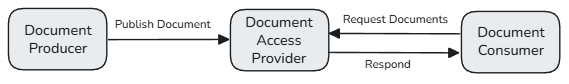
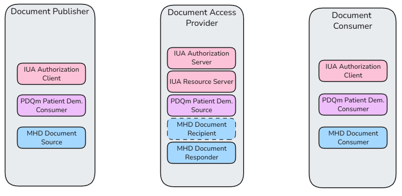
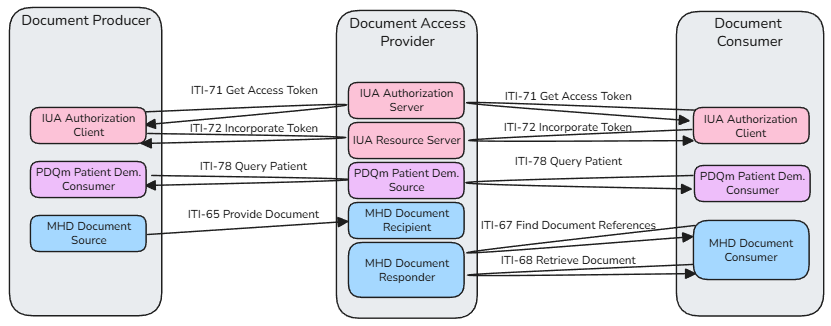
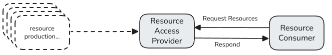
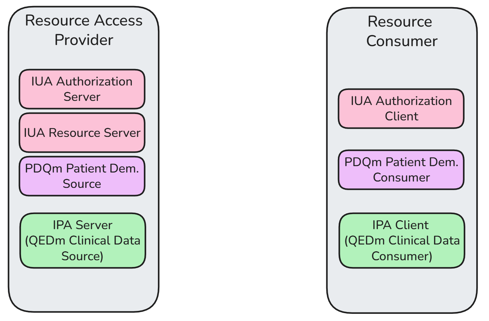
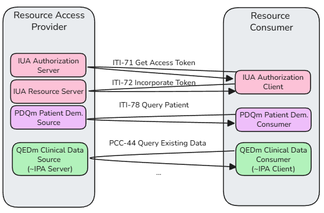
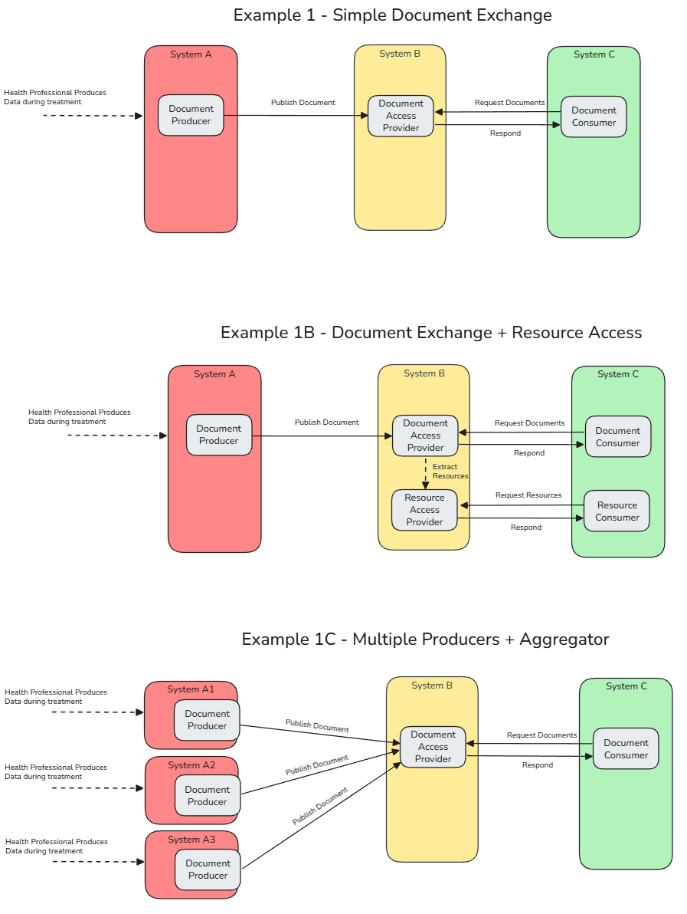
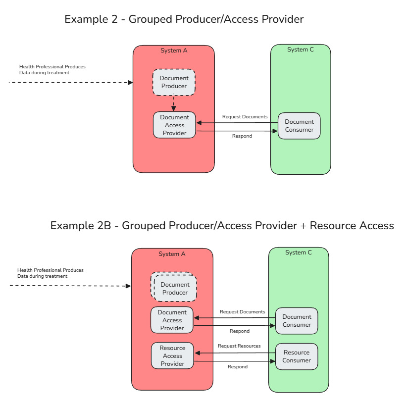

# Actors and Transactions

The actor model defined here is an orchestration of existing IHE actors and specifications, combined together into high-level composite actors. Actors and transactions are inherited from dependent IHE profiles, and those actors are stacked, constrained and potentially modified. 

This is similar to the approach taken in the MHDS specification, but with a more narrow subset of specifications fit to the european situation.

## Relevant Specifications:
- [IHE MHD](https://profiles.ihe.net/ITI/MHD/) - Defines exchange of Documents, which we use to exchange FHIR document content. (note: no XDS dependencies)
- [IHE IUA](https://profiles.ihe.net/ITI/IUA/index.html) - Defines authorization and access control actors and mechanisms. We use the actors and transactions model.
- [HL7 SMART Backend Services](https://build.fhir.org/ig/HL7/smart-app-launch/backend-services.html) - Defines authorization in FHIR. We use the SMART Backend Services profile for system-system authnz, and FHIR scopes. 
- [IHE PDQm](https://profiles.ihe.net/ITI/PDQm/index.html) - Defines how a client can perform patient lookup against a server.
- [HL7 International Patient Access](https://build.fhir.org/ig/HL7/fhir-ipa/) - Defines how an application can access FHIR information using SMART authorization and resource access.
- [IHE QEDm](https://profiles.ihe.net/PCC/QEDm/index.html) - Defines how a client can query for existing FHIR resources from a FHIR server.

# Document Exchange

Document exchange is defined with 3 actors:

  

1. **Document Producer (client)** - Produces EEHRxF FHIR Documents, publishes those documents to a Document Access Provider. Can be grouped with Access Provider, in which case the publishing transactions are internalized.

2. **Document Access Provider (server)** - Provides Access to EEHRxF FHIR Documents by offering an API which Document Consumer clients can query. Receives Documents from Document Producer (If not grouped with Document Producer).

3. **Document Consumer (client)** - Consumes EEHRxF FHIR documents by querying a Document Access Provider.

These composite actors inherit existing actors from the IUA, PDQm, and MHD specifications:

  

**Document Producer**
- [IUA Authorization Client](https://profiles.ihe.net/ITI/IUA/index.html#34111-authorization-client)
- [PDQm Patient Demographics Consumer](https://profiles.ihe.net/ITI/PDQm/volume-1.html) ([CapabilityStatement](https://profiles.ihe.net/ITI/PDQm/CapabilityStatement-IHE.PDQm.PatientDemographicsConsumerQuery.html))
- [MHD Document Source](https://profiles.ihe.net/ITI/MHD/1331_actors_and_transactions.html) ([CapabilityStatement](https://profiles.ihe.net/ITI/MHD/CapabilityStatement-IHE.MHD.DocumentSource.html))

**Document Access Provider**
- [IUA Authorization Server](https://profiles.ihe.net/ITI/IUA/index.html#34112-authorization-server)
- [IUA Resource Server](https://profiles.ihe.net/ITI/IUA/index.html#34113-resource-server)
- [PDQm Patient Demographics Supplier](https://profiles.ihe.net/ITI/PDQm/volume-1.html) ([CapabilityStatement](https://profiles.ihe.net/ITI/PDQm/CapabilityStatement-IHE.PDQm.PatientDemographicsSupplier.html))
- [MHD Document Recipient](https://profiles.ihe.net/ITI/MHD/1331_actors_and_transactions.html) ([CapabilityStatement](https://profiles.ihe.net/ITI/MHD/CapabilityStatement-IHE.MHD.DocumentRecipient.html))
- [MHD Document Responder](https://profiles.ihe.net/ITI/MHD/1331_actors_and_transactions.html) ([CapabilityStatement](https://profiles.ihe.net/ITI/MHD/CapabilityStatement-IHE.MHD.DocumentResponder.html))

**Document Consumer**
- [IUA Authorization Client](https://profiles.ihe.net/ITI/IUA/index.html#34111-authorization-client)
- [PDQm Patient Demographics Consumer](https://profiles.ihe.net/ITI/PDQm/volume-1.html) ([CapabilityStatement](https://profiles.ihe.net/ITI/PDQm/CapabilityStatement-IHE.PDQm.PatientDemographicsConsumerQuery.html))
- [MHD Document Consumer](https://profiles.ihe.net/ITI/MHD/1331_actors_and_transactions.html) ([CapabilityStatement](https://profiles.ihe.net/ITI/MHD/CapabilityStatement-IHE.MHD.DocumentConsumer.html))

This leads to the following required transactions between these actors:

  

TODO: Table.

TODO: Link to functional subpages for authorizatation, patient search, and document exchange, with details on these transactions.

This can be combined with content profiles define by each EHDS Priority Category, for those categories that are primarily represented as a FHIR Document. For example, a system can be a **Lab Result Document Producer**, a **Patient Summary Document Consumer**, or a **Imaging Manifest Document Access Provider**. See Content Library

# Resource Exchange

It is also useful in many cases to transact with individual FHIR resources (note: ref other page). For this purpose, two resource-based actors are defined:

  

4. **Resource Access Provider (server)** - A FHIR server providing access to FHIR resources by hosting search + read query API's.
5. **Resource Consumer (client)** - A FHIR client that consumes external FHIR resources by querying a Resource Access Provider.

<i>Note: What about Resource Producer? Click to expand</i>

Resource exchange is more complex than document publication, and in many cases has resource and use-case specific considerations. Within the scope of this IG, we assume a precondition that the Resource Access Provider has access to resources and focus on defining how the Resource Access Provider enables a consumer to search and read those resources. For more details and possible approaches, see the [Resource Exchange](resourceExchange.md) page.

These composite actors inherit existing actors from the IUA, PDQm, and QEDm/IPA specifications:

  

**Resource Access Provider**
- [IUA Authorization Server](https://profiles.ihe.net/ITI/IUA/index.html#34112-authorization-server)
- [IUA Resource Server](https://profiles.ihe.net/ITI/IUA/index.html#34113-resource-server)
- [PDQm Patient Demographics Supplier](https://profiles.ihe.net/ITI/PDQm/volume-1.html) ([CapabilityStatement](https://profiles.ihe.net/ITI/PDQm/CapabilityStatement-IHE.PDQm.PatientDemographicsSupplier.html)) 
- [Clinical Data Source](https://profiles.ihe.net/PCC/QEDm/volume-1.html#actors-and-transactions)
    - *alt:* [HL7 International Patient Access Server](https://build.fhir.org/ig/HL7/fhir-ipa/CapabilityStatement-ipa-server.html)

**Resource Consumer**
- [IUA Authorization Client](https://profiles.ihe.net/ITI/IUA/index.html#34111-authorization-client)
- [PDQm Patient Demographics Consumer](https://profiles.ihe.net/ITI/PDQm/volume-1.html) ([CapabilityStatement](https://profiles.ihe.net/ITI/PDQm/CapabilityStatement-IHE.PDQm.PatientDemographicsConsumerQuery.html))
- [Clinical Data Consumer](https://profiles.ihe.net/PCC/QEDm/volume-1.html#actors-and-transactions)
    - *alt:* [HL7 International Patient Access Client](https://build.fhir.org/ig/HL7/fhir-ipa/CapabilityStatement-ipa-client.html)

This leads to the following required transactions between these actors:

  

TODO: Analyis of what to inherit from IPA vs IHE QEDm vs EU Core. 

TODO: Choice of which resources from each priority area make sense to be in scope (NOT all of them). 

## Example Groupings

TODO: Josh Add Narrative.

  

  

# Use with Other IHE Profiles

Within this implemenation guide, we focus on the generalized document and resource access transactions - but a similar layered approach can be taken with other use case-specific IHE profiles. 

IUA + PDQM actors can be considered an **API Base**, since most interoperabiliy use cases have a shared need for authorization and patient identification.

We leave the details of implementation up to individual priority category area, but here are some examples of how this could be done: 

## ePrescription and eDispenation with IHE MPD
For example, the [IHE MPD specification actors](https://profiles.ihe.net/PHARM/MPD/actors-transactions.html) could be stacked in a similar way to accomplish a prescription workflow:

TODO: Diagram with IUA + PDQm + MPD Actors. Similar to above, but with MPD Actors for Order Placer, Order Receiver, ....

## Image Access with IHE MADO

TODO: Bas/Charles/etc to review/fix my mistakes.

In the imaging priority category, IHE-RAD (MADO) transactions are used to provide access to DICOM images.

The IHE MADO Profile starts with a precondition that an Image Consumer has gained access to a manifest. This could be accomplished by the Image Consumer bundling with the Document Consumer actor specified here - and querying a Document Access Provider for an image manifest. Then, the Image Consumer uses the information in the Image Manifest to construct a WADO-RS query to the Imaging Source (note: Auth could get complicated here).

A composite actor could be created inheriting Document Consumer + MADO Image Consumer. 

TODO: Diagram: Image Consumer as Document Consumer + Image Consumer

