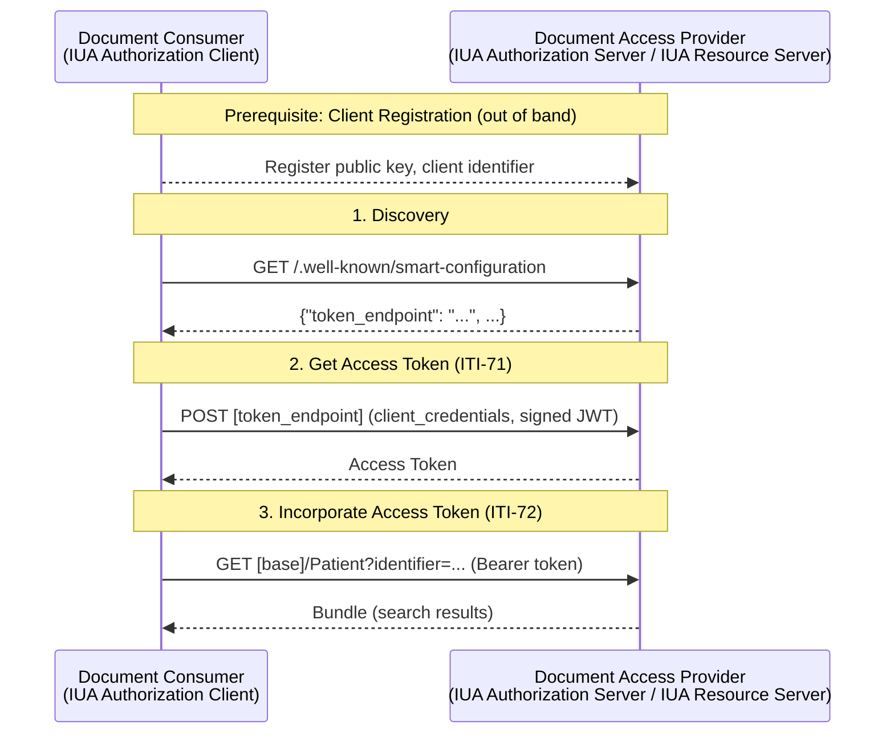
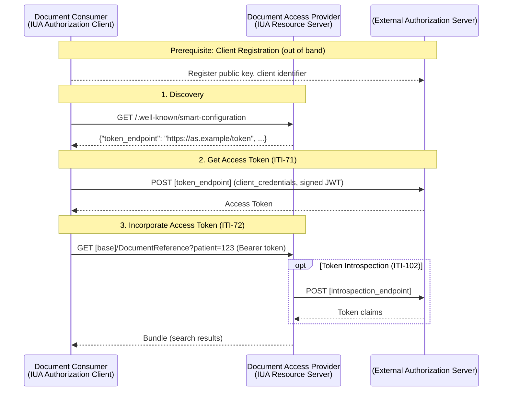

### Overview

Authorization is required for all API transactions. This IG inherits [SMART Backend Services](https://build.fhir.org/ig/HL7/smart-app-launch/backend-services.html) from [FHIR SMART App Launch](https://build.fhir.org/ig/HL7/smart-app-launch/app-launch.html) for system-to-system authorization, grouped with IHE IUA actors.

We adopt SMART Backend Services as specified—including grant types, client authentication (`private_key_jwt`), and related JWT requirements—to align with globally recognized specifications and reduce implementation burden. As a profile on SMART, all underlying SMART requirements still apply; omitting a detail from this IG does not exempt implementations from SMART requirements.

> **Note:** This IG uses IHE IUA actor definitions grouped with SMART Backend Services normative requirements. Where requirements differ, SMART Backend Services is authoritative.

### Scope: System-to-System Authorization

This specification defines **system-to-system** authorization only:
- Client systems authenticate with client credentials
- No user-level authentication is required at the API level

User-level authorization requirements are not in initial scope for this Implementation Guide.


### Authorization Actors

IHE IUA defines three key actors for authorization:

- **[Authorization Server](https://profiles.ihe.net/ITI/IUA/index.html#34112-authorization-server)** - Issues access tokens to clients after validating their identity credentials
- **[Resource Server](https://profiles.ihe.net/ITI/IUA/index.html#34113-resource-server)** - Validates tokens and enforces access control on protected resources (the FHIR API)
- **[Authorization Client](https://profiles.ihe.net/ITI/IUA/index.html#34111-authorization-client)** - A client that retrieves access tokens and presents them as part of transactions.


### IHE IUA Actor Groupings

- **Document/Resource Publisher:** IUA Authorization Client
- **Document/Resource Consumer:** IUA Authorization Client
- **Document/Resource Access Provider:** IUA Resource Server (required) + IUA Authorization Server (if internal)

#### Authorization Server Deployment

The Authorization Server may be **internal** (bundled with the Access Provider), or **external** (external to the Access Provider, for example a hospital, regional, or national authorization server). When external, the Access Provider system implements only Resource Server behaviors—this IG does not impose requirements on external authorization infrastructure.

---

### Authorization Flow



*This diagram shows the internal Authorization Server deployment. See [External Authorization Server](#external-authorization-server) for the external variant.*

#### Client Registration (Prerequisite)

Out of band, the Consumer registers identity credentials (public key, client identifier) with the Authorization Server (which may be hosted by the Access Provider). See [SMART App Launch: Registering a Client](https://hl7.org/fhir/smart-app-launch/client-confidential-asymmetric.html#registering-a-client-communicating-public-keys) for guidance on client registration and public key communication.

#### 1. Discovery {#authorization-server-discovery}

Resource Servers SHALL advertise their authorization configuration at `[base]/.well-known/smart-configuration`, per [SMART App Launch conformance](https://build.fhir.org/ig/HL7/smart-app-launch/conformance.html#using-well-known).

For backend services, clients use:
- `token_endpoint`
- `grant_types_supported` (include `client_credentials`)
- `jwks_uri` (when the Authorization Server publishes keys via JWKS)
- `capabilities` (include `client-confidential-asymmetric` when `private_key_jwt` is supported)

Resource Servers SHOULD advertise:
- `scopes_supported`

If the server supports `private_key_jwt` client authentication, it SHOULD advertise:
- `token_endpoint_auth_methods_supported` including `private_key_jwt`
- `token_endpoint_auth_signing_alg_values_supported` including at least one of `RS384` or `ES384` (per [SMART client-confidential-asymmetric](https://build.fhir.org/ig/HL7/smart-app-launch/client-confidential-asymmetric.html))

See [SMART Backend Services Discovery](https://build.fhir.org/ig/HL7/smart-app-launch/backend-services.html#discovery) for the full specification.

#### 2. Get Access Token (ITI-71) {#get-access-token}

Clients obtain tokens by POSTing to the token endpoint discovered via `.well-known/smart-configuration`.

**Token Request**:
- Grant type: `client_credentials`
- Client assertion: JWT signed by client private key
- Client authentication: Asymmetric (public key registered out-of-band)

**Token Issuance**:

The Authorization Server issues access tokens to registered clients using the `client_credentials` grant.

Authorization Servers SHALL validate `private_key_jwt` client authentication (including client assertion signature verification and required claims) per [SMART client-confidential-asymmetric](https://hl7.org/fhir/smart-app-launch/client-confidential-asymmetric.html), and issue tokens with scopes based on client authorization.

#### 3. Incorporate Access Token (ITI-72) {#incorporate-access-token}

Clients SHALL present the access token using the `Authorization` header:

```
Authorization: Bearer <access_token>
```

The access token SHALL be presented on all API requests to protected resources.

Resource Servers SHALL validate the access token, ensure that it has not expired, and that its scope covers the requested resource, per [SMART Backend Services](https://hl7.org/fhir/smart-app-launch/backend-services.html). The method used to validate the access token is beyond the scope of SMART Backend Services and generally involves coordination between the Resource Server and Authorization Server.

In deployments using an external Authorization Server, token validation commonly involves coordination with that Authorization Server; where supported and required by policy, Resource Servers MAY use token introspection via [IHE IUA ITI-102](https://profiles.ihe.net/ITI/IUA/index.html#3102-introspect-token-iti-102).

---

### Scopes

Scopes follow [SMART v2 conventions](https://build.fhir.org/ig/HL7/smart-app-launch/scopes-and-launch-context.html#scopes-for-requesting-fhir-resources) and align with required MHD and IPA transactions:

#### Document Publisher (MHD ITI-105)
- `system/DocumentReference.create` - Create DocumentReference
- `system/Patient.read` - Read Patient (for patient context)
- `system/Patient.search` - Search Patient (for patient matching)

#### Document Consumer (MHD ITI-67, ITI-68)
- `system/Patient.read` - Read Patient
- `system/Patient.search` - Search Patient
- `system/DocumentReference.read` - Read DocumentReference
- `system/DocumentReference.search` - Search DocumentReference
- `system/Binary.read` - Read Binary
- `system/Bundle.read` - Read Bundle (for FHIR Documents)

#### Resource Consumer (IPA)
- `system/Patient.read` - Read Patient
- `system/Patient.search` - Search Patient
- Additional scopes per resource type: `system/Observation.read`, `system/Observation.search`, `system/Condition.read`, `system/Condition.search`, `system/DiagnosticReport.read`, `system/DiagnosticReport.search`, etc.

#### Scope Conventions
- `.read` = read a single resource by ID
- `.search` = search for resources by criteria
- `.create` = create a new resource

#### External Authorization Server {#external-authorization-server}

When the Authorization Server is external (hospital, regional, or national infrastructure):



---


### Transport Security {#transport-security}

All API communications SHALL use secure transport as defined by [IHE ATNA Secure Node](https://profiles.ihe.net/ITI/TF/Volume1/ch-9.html) with the [TLS 1.2 Floor Option](https://profiles.ihe.net/ITI/TF/Volume1/ch-9.html#9.3.1.2).

### IUA and SMART Backend Services

This IG uses IHE IUA for actor definitions and groups those actors with SMART Backend Services behavior. IUA itself [notes its relationship to SMART-on-FHIR](https://profiles.ihe.net/ITI/IUA/#relation-to-smart-on-fhir): "IUA is not based on SMART-on-FHIR, but does strive to not conflict with that standard."

Where IUA and SMART Backend Services requirements differ, this IG follows SMART.

For example: this IG requires `private_key_jwt` client authentication (per SMART Backend Services). While `client_secret` with HTTP Basic Auth is IUA-compliant, it is NOT compliant with this IG.

### Potential Future Work: User-Level Authorization

User-level authorization (including patient-mediated access) is out of scope for this version of the implementation Guide. For patient-mediated access patterns, readers are encouraged to consider [SMART on FHIR App Launch](https://build.fhir.org/ig/HL7/smart-app-launch/) and [International Patient Access](https://build.fhir.org/ig/HL7/fhir-ipa/). Implementors might consider UDAP for dynamic client registration (see [FHIR UDAP Security IG](https://build.fhir.org/ig/HL7/fhir-udap-security-ig/)).

Integration with the EU Digital Identity Wallet and eIDAS framework may be addressed in future editions.

Member States MAY layer user-level authorization on top of system-to-system authorization as appropriate for their national infrastructure.

### References

- [SMART Application Launch](https://build.fhir.org/ig/HL7/smart-app-launch/index.html)
- [IHE IUA](https://profiles.ihe.net/ITI/IUA/index.html)
