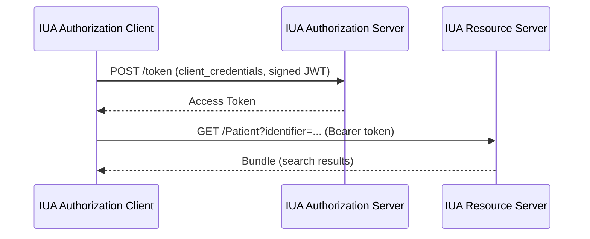

# Authorization

## Overview

Authorization is required for all API transactions. This IG uses SMART Backend Services for system-to-system authorization, grouped with IHE IUA actors.

## Scope: System-to-System Authorization

This specification defines **system-to-system** authorization only:
- Client systems authenticate with client credentials
- No user-level authentication is required at the API level
- User-level access decisions are the responsibility of national infrastructure

### Out of Scope for This Version

The following are explicitly out of scope for this version of the specification:
- User-facing OAuth2 flows (authorization_code grant)
- EIDAS authentication integration
- EU Digital Identity Wallet integration
- Patient-facing application authorization

These may be addressed in future versions. Member States MAY layer user-level authorization on top of system-to-system authorization as appropriate for their national infrastructure.

## Client Registration

Out of band, the Consumer registers identity credentials (public key, client identifier) with the Access Provider.

Future: Consider UDAP for dynamic client registration.
See [FHIR UDAP Security IG](https://build.fhir.org/ig/HL7/fhir-udap-security-ig/) for more details.

## Discovery {#authorization-server-discovery}

Servers SHALL advertise their authorization configuration at `[base]/.well-known/smart-configuration`.

Required fields include:
- `token_endpoint` - URL for token requests
- `token_endpoint_auth_methods_supported` - Must include `private_key_jwt`
- `scopes_supported` - Recommended to list supported scopes

See [SMART Backend Services Discovery](https://build.fhir.org/ig/HL7/smart-app-launch/backend-services.html#discovery) for the full specification.

## Token Issuance {#token-issuance}

The Authorization Server issues access tokens to registered clients using the `client_credentials` grant.

Servers SHALL:
- Validate the client assertion JWT signature against registered public keys
- Verify the JWT claims (`iss`, `sub`, `aud`, `exp`, `jti`)
- Issue tokens with requested scopes (if authorized for the client)
- Return tokens with appropriate expiration

## Obtaining Tokens {#obtaining-tokens}

Clients obtain tokens by POSTing to the token endpoint discovered via `.well-known/smart-configuration`.

**Token Request**:
- Grant type: `client_credentials`
- Client assertion: JWT signed by client private key
- Client authentication: Asymmetric (public key registered out-of-band)

## Token Validation {#requiring-tokens}

Servers SHALL validate tokens on every API request:
- Verify token signature
- Check token expiration (`exp` claim)
- Validate audience (`aud` matches server)
- Confirm requested operation is within granted scopes

## Presenting Tokens {#presenting-tokens}

Clients present tokens using the `Authorization` header:

```
Authorization: Bearer <access_token>
```

Tokens must be presented on all API requests to protected resources.

## Scopes

Scopes follow [SMART v2 conventions](https://build.fhir.org/ig/HL7/smart-app-launch/backend-services.html) and align with required MHD and QEDm transactions:

### Document Producer (MHD ITI-65)
- `system/DocumentReference.c` - Create DocumentReference
- `system/Binary.c` - Create Binary
- `system/Patient.rs` - Read/search Patient (for patient matching)

### Document Consumer (MHD ITI-67, ITI-68)
- `system/Patient.rs` - Read/search Patient
- `system/DocumentReference.rs` - Read/search DocumentReference
- `system/Binary.r` - Read Binary

### Resource Consumer (QEDm PCC-44)
- `system/Patient.rs` - Read/search Patient
- Additional scopes per resource type: `system/Observation.rs`, `system/Condition.rs`, `system/DiagnosticReport.rs`, etc.

### Scope Conventions
- `.r` = read
- `.s` = search
- `.rs` = read and search
- `.c` = create

## IHE IUA Actor Groupings

- **Document/Resource Producer:** IUA Authorization Client
- **Document/Resource Consumer:** IUA Authorization Client
- **Document/Resource Access Provider:** IUA Authorization Server + Resource Server

## Sequence Diagram



## Transport Security {#transport-security}

All API communications SHALL use TLS 1.2 or higher.

**Server Requirements**:
- Servers SHALL support TLS 1.2
- Servers SHOULD support TLS 1.3
- Servers SHALL NOT support TLS 1.1 or earlier versions
- Servers SHALL NOT support SSL in any version

**Certificate Requirements**:
- Certificates SHALL be issued by a trusted Certificate Authority (CA)
- Self-signed certificates SHALL NOT be used in production environments
- Certificates SHOULD use a minimum key size of 2048 bits for RSA or 256 bits for ECDSA

## References

- [SMART Backend Services](https://build.fhir.org/ig/HL7/smart-app-launch/backend-services.html)
- [IHE IUA](https://profiles.ihe.net/ITI/IUA/index.html)
- [IHE ITI-71 Get Access Token](https://profiles.ihe.net/ITI/IUA/index.html#372-get-access-token-iti-71)
