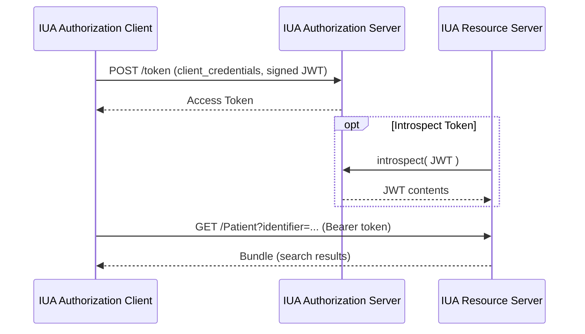
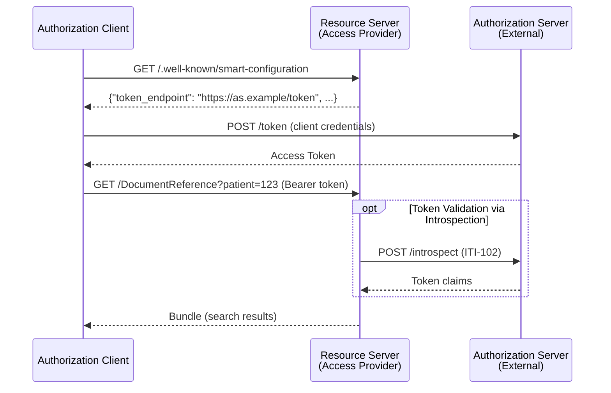

### Overview

Authorization is required for all API transactions. This IG inherits [SMART Backend Services](https://build.fhir.org/ig/HL7/smart-app-launch/backend-services.html) from [FHIR SMART App Launch](https://build.fhir.org/ig/HL7/smart-app-launch/app-launch.html) for system-to-system authorization, grouped with IHE IUA actors.

We adopt SMART Backend Services as specified—including token formats, JWT requirements, and authentication methods—to align with globally recognized specifications and reduce implementation burden. As a profile on SMART, all underlying SMART requirements still apply; omitting a detail from this IG does not exempt implementations from SMART requirements.

### Scope: System-to-System Authorization

This specification defines **system-to-system** authorization only:
- Client systems authenticate with client credentials
- No user-level authentication is required at the API level

User-level authorization requirements are not in initial scope for this Implementation Guide.

### Authorization Actors

IHE IUA defines two key actors for authorization:

- **[Authorization Server](https://profiles.ihe.net/ITI/IUA/index.html#34112-authorization-server)** - Issues access tokens to clients after validating their identity credentials
- **[Resource Server](https://profiles.ihe.net/ITI/IUA/index.html#34113-resource-server)** - Validates tokens and enforces access control on protected resources (the FHIR API)

These actors may be deployed together or separately, as described below.

#### Authorization Server Deployment

The Authorization Server may be **internal**  (bundled with the Access Provider) or **external** (external to the Access Provider, for example a hospital, regional, or national authorizationse rver). When external, the EHR system implements only Resource Server behaviors—this IG does not impose requirements on external authorization infrastructure.

See [Sequence Diagrams](#sequence-diagrams) below for how the flow differs between internal and external deployments.

### IHE IUA Actor Groupings

- **Document/Resource Publisher:** IUA Authorization Client
- **Document/Resource Consumer:** IUA Authorization Client
- **Document/Resource Access Provider:** IUA Resource Server (required) + IUA Authorization Server (if internal)

---

### Authorization Flow

#### 1. Discovery {#authorization-server-discovery}

Resource Servers SHALL advertise their authorization configuration at `[base]/.well-known/smart-configuration`. This tells clients where to obtain tokens, pointing to an internal or external Authorization Server.

Required fields include:
- `token_endpoint` - URL for token requests (points to internal or external AS)
- `token_endpoint_auth_methods_supported` - Must include `private_key_jwt`
- `scopes_supported` - Recommended to list supported scopes

See [SMART Backend Services Discovery](https://build.fhir.org/ig/HL7/smart-app-launch/backend-services.html#discovery) for the full specification.

#### 2. Client Registration

Out of band, the Consumer registers identity credentials (public key, client identifier) with the Authorization Server. See [SMART App Launch: Registering a Client](https://hl7.org/fhir/smart-app-launch/client-confidential-asymmetric.html#registering-a-client-communicating-public-keys) for guidance on client registration and public key communication.

#### 3. Obtaining Tokens {#obtaining-tokens}

Clients obtain tokens by POSTing to the token endpoint discovered via `.well-known/smart-configuration`.

**Token Request**:
- Grant type: `client_credentials`
- Client assertion: JWT signed by client private key
- Client authentication: Asymmetric (public key registered out-of-band)

#### 4. Presenting Tokens {#presenting-tokens}

Clients present tokens using the `Authorization` header:

```
Authorization: Bearer <access_token>
```

Tokens must be presented on all API requests to protected resources.

#### 5. Token Issuance {#token-issuance}

The Authorization Server issues access tokens to registered clients using the `client_credentials` grant.

Authorization Servers SHALL:
- Validate the client assertion JWT signature against registered public keys
- Verify the JWT claims (`iss`, `sub`, `aud`, `exp`, `jti`)
- Issue tokens holding scopes based on the requested scopes (if authorized for the client)
- Return tokens with appropriate expiration

#### 6. Token Validation {#requiring-tokens}

Resource Servers SHALL validate tokens on every API request:
- Verify token signature
- Check token expiration (`exp` claim)
- Validate audience (`aud` matches server)
- Confirm the requested API operation is within granted scopes

When the Authorization Server is external, the Resource Server may validate tokens via:
- Local validation using shared keys or certificates
- Token introspection via [IHE IUA ITI-102](https://profiles.ihe.net/ITI/IUA/index.html#3102-introspect-token-iti-102)

For comprehensive token validation guidance including `jti` tracking and signature verification details, see [SMART App Launch: Signature Verification](https://hl7.org/fhir/smart-app-launch/client-confidential-asymmetric.html#signature-verification).

---

### Sequence Diagrams

#### Internal Authorization Server (Bundled)

When the Authorization Server is bundled with the Access Provider:



#### External Authorization Server

When the Authorization Server is external (hospital, regional, or national infrastructure):



---

### Scopes

Scopes follow [SMART v2 conventions](https://build.fhir.org/ig/HL7/smart-app-launch/scopes-and-launch-context.html#scopes-for-requesting-fhir-resources) and align with required MHD and IPA transactions:

#### Document Publisher (MHD ITI-105)
- `system/DocumentReference.create` - Create DocumentReference
- `system/Patient.read` - Read Patient (for patient context)
- `system/Patient.search` - Search Patient (for patient matching)

#### Document Consumer (MHD ITI-67, ITI-68)
- `system/Patient.read` - Read Patient
- `system/Patient.search` - Search Patient
- `system/DocumentReference.read` - Read DocumentReference
- `system/DocumentReference.search` - Search DocumentReference
- `system/Binary.read` - Read Binary
- `system/Bundle.read` - Read Bundle (for FHIR Documents)

#### Resource Consumer (IPA)
- `system/Patient.read` - Read Patient
- `system/Patient.search` - Search Patient
- Additional scopes per resource type: `system/Observation.read`, `system/Observation.search`, `system/Condition.read`, `system/Condition.search`, `system/DiagnosticReport.read`, `system/DiagnosticReport.search`, etc.

#### Scope Conventions
- `.read` = read a single resource by ID
- `.search` = search for resources by criteria
- `.create` = create a new resource

### Transport Security {#transport-security}

All API communications SHALL use secure transport as defined by [IHE ATNA Secure Node](https://profiles.ihe.net/ITI/TF/Volume1/ch-9.html) with the [TLS 1.2 Floor Option](https://profiles.ihe.net/ITI/TF/Volume1/ch-9.html#9.3.1.2).

### Potential Future Work: User-Level Authorization

User-level authorization (including patient-mediated access) is out of scope for this version of the implementation Guide. For patient-mediated access patterns, readers are encouraged to consider [SMART on FHIR App Launch](https://build.fhir.org/ig/HL7/smart-app-launch/) and [International Patient Access](https://build.fhir.org/ig/HL7/fhir-ipa/). Implementors might consider UDAP for dynamic client registration (see [FHIR UDAP Security IG](https://build.fhir.org/ig/HL7/fhir-udap-security-ig/)).

Integration with the EU Digital Identity Wallet and eIDAS framework may be addressed in future editions.

Member States MAY layer user-level authorization on top of system-to-system authorization as appropriate for their national infrastructure.

### References

- [SMART Application Launch](https://build.fhir.org/ig/HL7/smart-app-launch/index.html)
- [IHE IUA](https://profiles.ihe.net/ITI/IUA/index.html)
- [IHE ITI-71 Get Access Token](https://profiles.ihe.net/ITI/IUA/index.html#372-get-access-token-iti-71)
