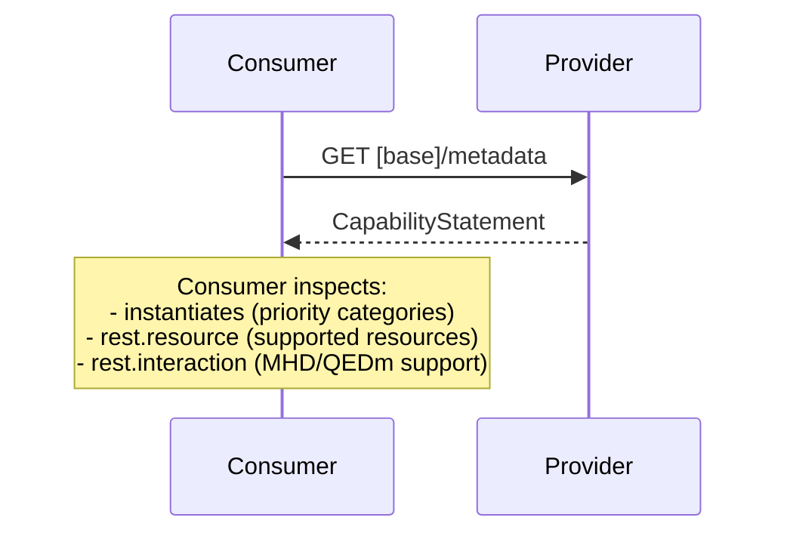

### Overview

Systems discover capabilities via FHIR CapabilityStatement (`GET /metadata`). This allows consumers to inspect what functionality a provider supports before attempting transactions.

### Transaction

Capability discovery uses the standard FHIR capabilities interaction:

```
GET [base]/metadata
```

The server returns a CapabilityStatement resource that declares:
- Supported FHIR version
- Supported resource types
- Supported interactions (read, search, create, etc.)
- Supported search parameters
- Priority category support (see below)

### Provider Actors

Different provider actors advertise different capabilities:

- **Document Access Provider**: Advertises document exchange capabilities (MHD ITI-65, ITI-67, ITI-68 transactions)
- **Resource Access Provider**: Advertises resource query capabilities (QEDm PCC-44 transactions)

A system may implement one or both sets of capabilities depending on its role.

### Priority Category Support

Servers declare which EHDS ANNEX II priority categories they support using `CapabilityStatement.instantiates` to reference the appropriate capability statements defined in this IG:

- European Patient Summary (EPS)
- Medication Prescription & Dispense (MPD)
- Laboratory Results
- Hospital Discharge Reports (HDR)
- Imaging Reports
- Imaging Manifests (R5, future extension)

**Mechanism**:

Providers instantiate one or more of the following CapabilityStatements:
- Document Access Provider for [Priority Area] (references DocumentReference profiles, MHD transactions)
- Resource Access Provider for [Priority Area] (references resource profiles, QEDm transactions)

Consumers inspect `CapabilityStatement.instantiates` to determine which priority categories are supported and which exchange patterns (document vs resource) are available.

### Example Capability Discovery Flow



### See Also
- [FHIR CapabilityStatement](https://hl7.org/fhir/R4/capabilitystatement.html)
- [Actors and Transactions](actors.html)
- [IHE MHD](https://profiles.ihe.net/ITI/MHD/)
- [IHE QEDm](https://profiles.ihe.net/PCC/QEDm/)
