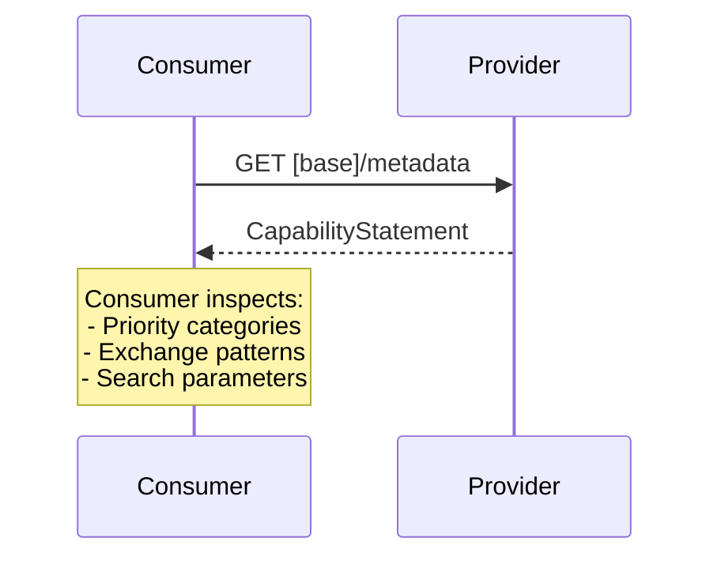

# Capability Discovery

## Overview

Systems discover capabilities via FHIR CapabilityStatement (`GET /metadata`). This allows consumers to inspect what functionality a provider supports before attempting transactions.

## Transaction

Capability discovery uses the standard FHIR capabilities interaction:

```
GET [base]/metadata
```

The server returns a CapabilityStatement resource that declares:
- Supported FHIR version
- Supported resource types
- Supported interactions (read, search, create, etc.)
- Supported search parameters
- Priority category support (see below)

## Actor Roles

| Actor | Role |
|-------|------|
| Consumer | Inspect the capabilities of a provider |
| Provider | Provide information on its capabilities via CapabilityStatement |

## Priority Category Support

Servers declare which EHDS ANNEX II priority categories they support:
- European Patient Summary (EPS)
- Medication Prescription & Dispense (MPD)
- Laboratory Results
- Hospital Discharge Reports (HDR)
- Imaging Reports
- Imaging Manifests

**Mechanism:** TBD (CapabilityStatement.instantiates, extension, or other approach)

## Content Registry

Priority categories link to external HL7 EU IGs:
- Category → IG canonical URL + version
- DocumentReference.type/format allowed value sets per category
- Servers enforce content registry on publication and query

## Provider Actors

Different provider actors advertise different capabilities:

- **Document Access Provider**: Advertises document exchange capabilities (MHD transactions)
- **Resource Access Provider**: Advertises resource query capabilities (QEDm transactions)

A system may implement one or both sets of capabilities depending on its role.

## Example Capability Discovery Flow



## See Also
- [FHIR CapabilityStatement](https://hl7.org/fhir/R4/capabilitystatement.html)
- [Actors and Transactions](actors.html)
