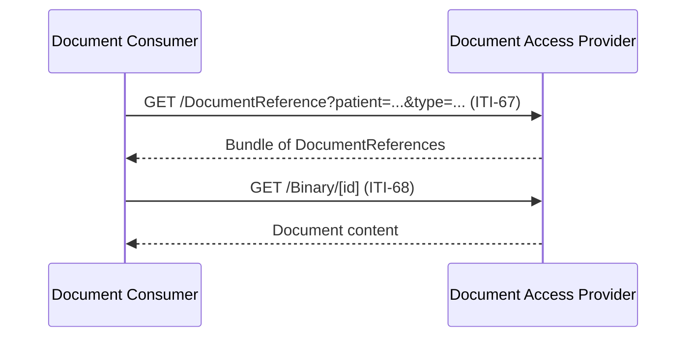

### Overview

Document exchange using IHE MHD (Mobile Health Documents) transactions. This IG inherits MHD transactions as-is, with constraints specific to EEHRxF content.

### Actors

- **Document Producer** (client): Publishes documents using MHD Document Source
- **Document Access Provider** (server): Receives and serves documents using MHD Document Recipient + Document Responder
- **Document Consumer** (client): Queries and retrieves documents using MHD Document Consumer

See [Actors and Transactions](actors.html) for detailed actor groupings.

### IHE MHD Transactions

This IG uses the following IHE MHD transactions:

| Transaction | Direction | Description | Scope |
|-------------|-----------|-------------|-------|
| [ITI-67](https://profiles.ihe.net/ITI/MHD/ITI-67.html) | Consumer → Provider | Find Document References | `system/DocumentReference.rs` |
| [ITI-68](https://profiles.ihe.net/ITI/MHD/ITI-68.html) | Consumer → Provider | Retrieve Document | `system/Binary.r` |
| [ITI-65](https://profiles.ihe.net/ITI/MHD/ITI-65.html) | Producer → Provider | Provide Document Bundle | `system/DocumentReference.c`, `system/Binary.c` |

### Sequence Diagram



### Examples

#### Patient Summary

```http
GET [base]/DocumentReference?patient=Patient/123&type=http://loinc.org|60591-5&status=current
```

#### Medical Test Results

```http
GET [base]/DocumentReference?patient=Patient/123&type=http://loinc.org|11502-2&status=current
```

#### Imaging Reports

```http
GET [base]/DocumentReference?patient=Patient/123&category=urn:oid:1.3.6.1.4.1.19376.1.2.6.1|REPORTS&context.practiceSetting=http://snomed.info/sct|394914008&status=current
```

#### Imaging Manifests

```http
GET [base]/DocumentReference?patient=Patient/123&category=urn:oid:1.3.6.1.4.1.19376.1.2.6.1|IMAGES&status=current
```

#### Hospital Discharge Reports

```http
GET [base]/DocumentReference?patient=Patient/123&type=http://loinc.org|18842-5&status=current
```

### Document Publication (ITI-65)

Document Producers publish documents by POSTing a transaction Bundle:

```http
POST [base]
Content-Type: application/fhir+json
```

The Bundle contains DocumentReference + Binary resources. See [IHE MHD ITI-65](https://profiles.ihe.net/ITI/MHD/ITI-65.html) for details.

### Document Search Strategy

This IG follows the [IHE approach for document discovery](https://wiki.ihe.net/index.php/XDS_classCode_Metadata_Coding_System). See [Open Issues](open-issues.html#issue-1-document-search-and-priority-category-differentiation) for discussion on this approach.

1. **Category** (coarse search): XDS ClassCode for broad classification
2. **Type** (clinical precision): LOINC codes for specific document types
3. **practiceSetting**: Differentiate clinical specialty (e.g., lab vs radiology)

#### Category Values (XDS ClassCode)

| Code | Use For |
|------|---------|
| `REPORTS` | Medical test results, imaging reports |
| `SUMMARIES` | Patient summaries, discharge summaries |
| `IMAGES` | Imaging manifests |
| `PRESCRIPTIONS` | Medication prescriptions |
| `DISPENSATIONS` | Medication dispensation records |

See [EEHRxFDocumentClassVS](ValueSet-eehrxf-document-class-vs.html) for the complete list.

#### Type Values (LOINC)

| LOINC Code | Priority Category |
|------------|-------------------|
| `60591-5` | Patient Summary |
| `18842-5` | Hospital Discharge Report |
| `11502-2` | Medical Test Results |
| `68604-8` | Diagnostic Imaging Report |

See [EEHRxFDocumentTypeVS](ValueSet-eehrxf-document-type-vs.html) for the complete list.

### References

- [IHE MHD Specification](https://profiles.ihe.net/ITI/MHD/)
- [IHE XDS ClassCode Metadata](https://wiki.ihe.net/index.php/XDS_classCode_Metadata_Coding_System)
- [Actors and Transactions](actors.html)
