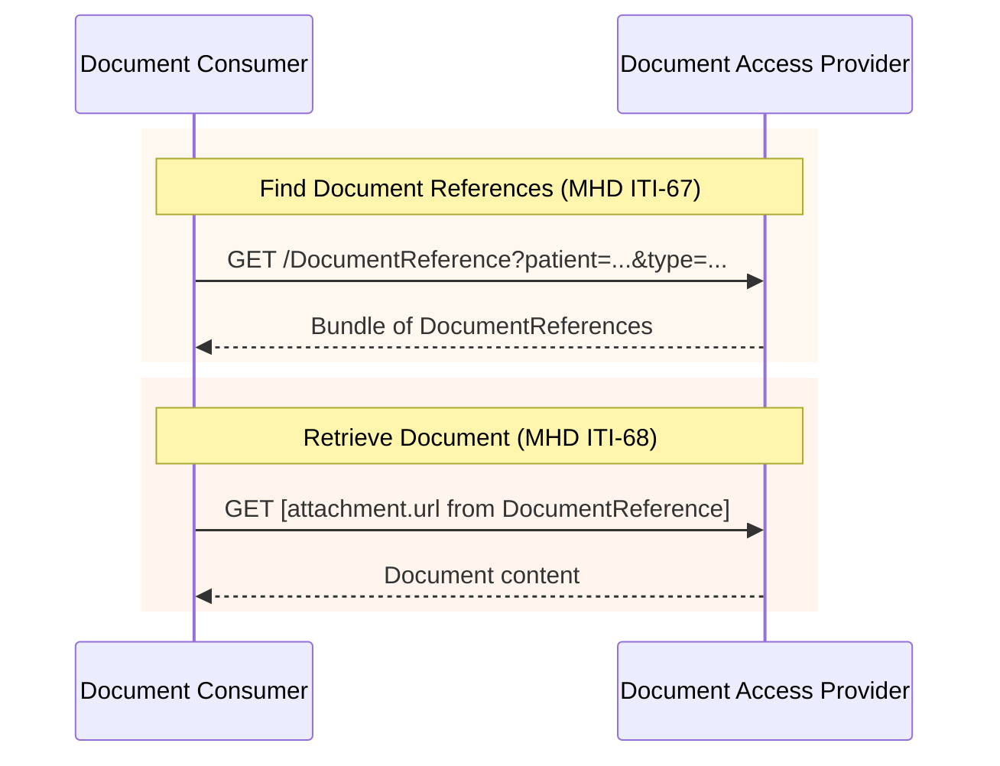

### Overview

Document exchange using IHE MHD (Mobile Health Documents) transactions. This IG inherits MHD transactions as-is, with constraints specific to EEHRxF content.

### Actors

- **Document Producer** (client): Publishes documents using MHD Document Source
- **Document Access Provider** (server): Receives and serves documents using MHD Document Recipient + Document Responder
- **Document Consumer** (client): Queries and retrieves documents using MHD Document Consumer

See [Actors and Transactions](actors.html) for detailed actor groupings.

### IHE MHD Transactions

This IG uses the following IHE MHD transactions:

| Transaction | Direction | Description | Scope |
|-------------|-----------|-------------|-------|
| [ITI-67](https://profiles.ihe.net/ITI/MHD/ITI-67.html) | Document Consumer → Document Access Provider | Find Document References | `system/DocumentReference.rs` |
| [ITI-68](https://profiles.ihe.net/ITI/MHD/ITI-68.html) | Document Consumer → Document Access Provider | Retrieve Document | See note below |
| [ITI-65](https://profiles.ihe.net/ITI/MHD/ITI-65.html) | Document Producer → Document Access Provider | Provide Document Bundle | `system/DocumentReference.c`, `system/Binary.c` or `system/Bundle.c` |

> **ITI-68 Scope Note:** The required scope depends on the document format. For non-FHIR documents (PDF), use `system/Binary.r`. For FHIR Documents (IPS, laboratory reports as FHIR Bundles), use `system/Bundle.r`. See [FHIR Documents vs Binary](#fhir-documents-vs-binary) below.

### Sequence Diagram



#### FHIR Documents vs Binary

ITI-68 retrieves the document from the URL specified in `DocumentReference.content.attachment.url`. The URL format depends on the document type:

| Document Format | attachment.url | Content-Type |
|-----------------|----------------|--------------|
| PDF and other non-FHIR | `/Binary/[id]` | `application/pdf`, etc. |
| FHIR Document (IPS, etc.) | `/Bundle/[id]` | `application/fhir+json` or `application/fhir+xml` |

This follows [MHD Section 2:3.65.4.1.2.1](https://profiles.ihe.net/ITI/MHD/ITI-65.html#236541-message-semantics), which specifies the **FHIR Document Publish Option**: when the `DocumentReference.content.attachment.url` points at a FHIR Document Bundle, that Bundle is retrieved directly without Binary encoding.

> **Implementation Note:** FHIR Documents do not require base64 encoding into a Binary resource. The document Bundle is stored and retrieved as a native FHIR Bundle resource.

### Document Search Strategy

This IG follows the [IHE approach for document discovery](https://wiki.ihe.net/index.php/XDS_classCode_Metadata_Coding_System):

1. **Category** (coarse search): XDS ClassCode for broad classification
2. **Type** (clinical precision): LOINC codes for specific document types
3. **practiceSetting**: Differentiate clinical specialty (e.g., lab vs radiology)

> **Open Issue #1**: We are seeking input on the document search approach. See [Document Search and Priority Category Differentiation](open-issues.html#issue-1-document-search-and-priority-category-differentiation) for discussion and alternatives.

#### Category Values (XDS ClassCode)

| Code | Use For |
|------|---------|
| `REPORTS` | Medical test results, imaging reports |
| `SUMMARIES` | Patient summaries, discharge summaries |
| `IMAGES` | Imaging manifests |
| `PRESCRIPTIONS` | Medication prescriptions |
| `DISPENSATIONS` | Medication dispensation records |

See [EEHRxFDocumentClassVS](ValueSet-eehrxf-document-class-vs.html) for the complete list.

#### Type Values (LOINC)

| LOINC Code | Priority Category |
|------------|-------------------|
| `60591-5` | Patient Summary |
| `18842-5` | Hospital Discharge Report |
| `11502-2` | Medical Test Results |
| `68604-8` | Diagnostic Imaging Report |

See [EEHRxFDocumentTypeVS](ValueSet-eehrxf-document-type-vs.html) for the complete list.

### Examples

#### Patient Summary

```
GET [base]/DocumentReference?patient=Patient/123&type=http://loinc.org|60591-5&status=current
```

#### Medical Test Results

```
GET [base]/DocumentReference?patient=Patient/123&type=http://loinc.org|11502-2&status=current
```

#### Imaging Reports

```
GET [base]/DocumentReference?patient=Patient/123&category=urn:oid:1.3.6.1.4.1.19376.1.2.6.1|REPORTS&context.practiceSetting=http://snomed.info/sct|394914008&status=current
```

#### Imaging Manifests

```
GET [base]/DocumentReference?patient=Patient/123&category=urn:oid:1.3.6.1.4.1.19376.1.2.6.1|IMAGES&status=current
```

> **Open Issue #8**: We are seeking input on how imaging manifests should be coded. See [Imaging Manifest Coding](open-issues.html#issue-8-imaging-manifest-coding) for discussion.

#### Hospital Discharge Reports

```
GET [base]/DocumentReference?patient=Patient/123&type=http://loinc.org|18842-5&status=current
```

### Document Publication (ITI-65)

Document Producers publish documents by POSTing a transaction Bundle:

```
POST [base]
Content-Type: application/fhir+json
```

The Bundle contains DocumentReference + Binary resources. See [IHE MHD ITI-65](https://profiles.ihe.net/ITI/MHD/ITI-65.html) for details.

> **Open Issue #3**: We are seeking input on MHD publication transaction options. See [MHD Publication Transaction Options](open-issues.html#issue-3-mhd-publication-transaction-options) for discussion.

### References

- [IHE MHD Specification](https://profiles.ihe.net/ITI/MHD/)
- [IHE XDS ClassCode Metadata](https://wiki.ihe.net/index.php/XDS_classCode_Metadata_Coding_System)
- [Actors and Transactions](actors.html)
