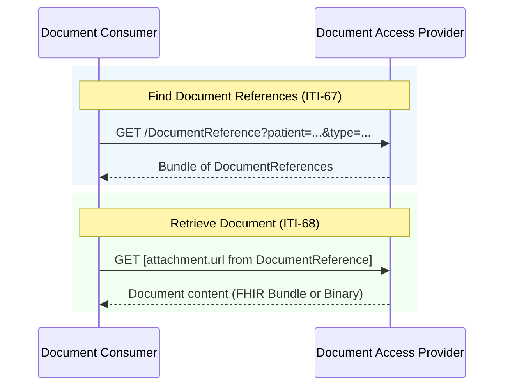

### Overview

Document exchange using IHE MHD (Mobile Health Documents) transactions. This IG inherits MHD transactions as-is, with constraints specific to EEHRxF content.

### Actors and Transactions

This IG defines three document exchange actors. See [Actors](actors.html) for detailed actor groupings.

| Actor | Transaction | Optionality |
|-------|-------------|-------------|
| [Document Consumer](actors.html#document-consumer) | [ITI-67](https://profiles.ihe.net/ITI/MHD/ITI-67.html) Find Document References | R |
| [Document Consumer](actors.html#document-consumer) | [ITI-68](https://profiles.ihe.net/ITI/MHD/ITI-68.html) Retrieve Document | R |
| [Document Access Provider](actors.html#document-access-provider) | [ITI-67](https://profiles.ihe.net/ITI/MHD/ITI-67.html) Find Document References | R |
| [Document Access Provider](actors.html#document-access-provider) | [ITI-68](https://profiles.ihe.net/ITI/MHD/ITI-68.html) Retrieve Document | R |
| [Document Access Provider](actors.html#document-access-provider) | [ITI-105: Simplified Publish](https://profiles.ihe.net/ITI/MHD/ITI-105.html) Simplified Publish | O |
| [Document Publisher](actors.html#document-publisher) | [ITI-105: Simplified Publish](https://profiles.ihe.net/ITI/MHD/ITI-105.html) | R |

---

### Document Consumption

The primary workflow is **query and retrieve**: Document Consumers find documents via ITI-67, then retrieve content via ITI-68.

#### Sequence Diagram



#### Document Content

ITI-68 retrieves the document from the URL specified in `DocumentReference.content.attachment.url`. The URL format depends on the document type:

| Document Format | attachment.url | Content-Type |
|-----------------|----------------|--------------|
| FHIR Document (Patient Summary, etc.) | `/Bundle/[id]` | `application/fhir+json` or `application/fhir+xml` |
| PDF and other non-FHIR | `/Binary/[id]` | `application/pdf`, etc. |

[ITI-68](https://profiles.ihe.net/ITI/MHD/ITI-68.html) retrieves the document directly from the URL. FHIR Documents are returned as Bundle resources when `Accept: application/fhir+json` is specified.

> **Authorization Scope:** The required scope depends on the document format. For non-FHIR documents (PDF), use `system/Binary.read`. For FHIR Documents, use `system/Bundle.read`.

#### Document Search Strategy

This IG follows the [IHE Document Sharing](https://profiles.ihe.net/ITI/HIE-Whitepaper/index.html) approach:

1. **category** (coarse search): Broad classification based on EHDS priority categories
2. **type** (clinical precision): Specific document types, typically LOINC codes

##### Category Values (EHDS Priority Categories)

The EHDS priority categories are defined by [Article 14 of the EHDS Regulation](https://eur-lex.europa.eu/eli/reg/2025/327/oj#d1e2289-1-1). We define codes specifically for EEHRxF that map directly to these regulatory categories.

See [EEHRxFDocumentPriorityCategoryCS](CodeSystem-eehrxf-document-priority-category-cs.html) for the complete list.

##### Type Values (LOINC)

| LOINC Code | Priority Category |
|------------|-------------------|
| `60591-5` | Patient Summary |
| `18842-5` | Hospital Discharge Report |
| `11502-2` | Lab Result |
| `68604-8` | Diagnostic Imaging Report |

See [EEHRxFDocumentTypeVS](ValueSet-eehrxf-document-type-vs.html) for the complete list.

#### Search Examples

The examples below show queries using both `category` (EHDS priority category) and `type` (LOINC document type). Either can be used depending on your use case.

##### Patient Summary

By type (LOINC):
```
GET [base]/DocumentReference?patient=Patient/123&type=http://loinc.org|60591-5&status=current
```

By category (EHDS priority):
```
GET [base]/DocumentReference?patient=Patient/123&category=http://hl7.eu/fhir/eu-health-data-api/CodeSystem/eehrxf-document-priority-category-cs|Patient-Summaries&status=current
```

##### Medical Test Results (Laboratory)

By type (LOINC):
```
GET [base]/DocumentReference?patient=Patient/123&type=http://loinc.org|11502-2&status=current
```

By category (EHDS priority):
```
GET [base]/DocumentReference?patient=Patient/123&category=http://hl7.eu/fhir/eu-health-data-api/CodeSystem/eehrxf-document-priority-category-cs|Laboratory-Reports&status=current
```

##### Imaging Reports and Manifests

By type (LOINC - imaging reports only):
```
GET [base]/DocumentReference?patient=Patient/123&type=http://loinc.org|68604-8&status=current
```

By category (EHDS priority - includes both reports and manifests):
```
GET [base]/DocumentReference?patient=Patient/123&category=http://hl7.eu/fhir/eu-health-data-api/CodeSystem/eehrxf-document-priority-category-cs|Medical-Imaging&status=current
```

> **Note:** The `Medical-Imaging` category includes both imaging reports and imaging manifests. To distinguish between them, use the `type` code or `formatCode`. See [Imaging Manifest](priority-area-imaging-manifest.html) for details.

##### Hospital Discharge Reports

By type (LOINC):
```
GET [base]/DocumentReference?patient=Patient/123&type=http://loinc.org|18842-5&status=current
```

By category (EHDS priority):
```
GET [base]/DocumentReference?patient=Patient/123&category=http://hl7.eu/fhir/eu-health-data-api/CodeSystem/eehrxf-document-priority-category-cs|Discharge-Reports&status=current
```

---

### Document Publication

When Document Publisher and Document Access Provider are **separate systems**, the Publisher submits documents using [ITI-105 Simplified Publish](https://profiles.ihe.net/ITI/MHD/ITI-105.html) per the [MHD Simplified Publish Option](https://profiles.ihe.net/ITI/MHD/1332_actor_options.html#13324-simplified-publish-option). When they are **grouped** (co-located), publication is internal.

#### Document Submission Option

The Document Access Provider MAY support receiving documents from external Publishers by implementing the [MHD Simplified Publish Option](https://profiles.ihe.net/ITI/MHD/1332_actor_options.html#13324-simplified-publish-option). This is the **Document Submission Option**.

Systems implementing this option declare it via [EEHRxF-DocumentAccessProvider-SubmissionOption](CapabilityStatement-EEHRxF-DocumentAccessProvider-SubmissionOption.html). See [Actors - Document Submission Option](actors.html#document-submission-option) for actor groupings.

#### ITI-105 Simplified Publish

```
POST [base]/DocumentReference
Content-Type: application/fhir+json

{
  "resourceType": "DocumentReference",
  "status": "current",
  "type": { ... },
  "subject": { "reference": "Patient/123" },
  "content": [{
    "attachment": {
      "contentType": "application/fhir+json",
      "data": "[base64-encoded document]"
    }
  }]
}
```

The server validates, extracts, and persists the document, returning the created DocumentReference with server-assigned IDs. See [IHE MHD ITI-105](https://profiles.ihe.net/ITI/MHD/ITI-105.html) for details.

> **How ITI-105 handles document content:** Per [MHD ITI-105 Expected Actions](https://profiles.ihe.net/ITI/MHD/ITI-105.html), the Document Recipient extracts the document from `attachment.data` and persists it such that it is retrievable via `attachment.url`. This means consumers querying via ITI-67 receive DocumentReferences with URLs pointing to `/Bundle/[id]` (for FHIR Documents) or `/Binary/[id]` (for PDFs, DICOM), and ITI-68 retrieval returns the native document format—not base64.

#### Other Publication Transactions

This IG specifies ITI-105 as the publication mechanism for Document Publishers submitting to external Access Providers. ITI-105 provides a single publication pattern that handles all EHDS content types (FHIR Documents, legacy PDFs, and DICOM manifests) while keeping publisher implementation simple—the Document Access Provider handles normalization on ingest, ensuring consumers always retrieve native document formats via ITI-67/ITI-68.

Member states or local deployments MAY additionally support:

- **[ITI-65 Provide Document Bundle](https://profiles.ihe.net/ITI/MHD/ITI-65.html)**: For XDS-centric ecosystems requiring explicit SubmissionSet metadata or multi-document submission.
- **[ITI-106 Generate Metadata](https://profiles.ihe.net/ITI/MHD/ITI-106.html)**: For structured document publishers wanting server-generated DocumentReference.

These are not required for EEHRxF conformance.

---

### References

- [IHE MHD Specification](https://profiles.ihe.net/ITI/MHD/)
- [IHE Document Sharing](https://profiles.ihe.net/ITI/HIE-Whitepaper/index.html)
- [Actors and Transactions](actors.html)
