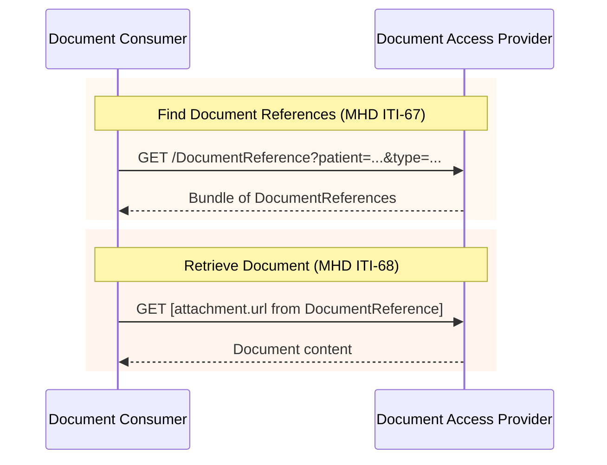

### Overview

Document exchange using IHE MHD (Mobile Health Documents) transactions. This IG inherits MHD transactions as-is, with constraints specific to EEHRxF content.

### Actors

- **Document Publisher** (client): Publishes documents using MHD Document Source
- **Document Access Provider** (server): Serves documents via MHD Document Responder. Optionally receives documents via Document Submission Option.
- **Document Consumer** (client): Queries and retrieves documents using MHD Document Consumer

See [Actors and Transactions](actors.html) for detailed actor groupings.

### IHE MHD Transactions

This IG uses the following IHE MHD transactions:

| Transaction | Direction | Description | Optionality |
|-------------|-----------|-------------|-------------|
| [ITI-67](https://profiles.ihe.net/ITI/MHD/ITI-67.html) | Consumer → Access Provider | Find Document References | R |
| [ITI-68](https://profiles.ihe.net/ITI/MHD/ITI-68.html) | Consumer → Access Provider | Retrieve Document | R |
| [ITI-105](https://profiles.ihe.net/ITI/MHD/ITI-105.html) | Publisher → Access Provider | Simplified Publish | O* |

*ITI-105 is REQUIRED for Document Publishers publishing to external Access Providers. It is OPTIONAL for Access Providers (Document Submission Option). When Publisher and Access Provider are grouped, publication is internal.


### Sequence Diagram



#### Document Content 

ITI-68 retrieves the document from the URL specified in `DocumentReference.content.attachment.url`. The URL format depends on the document type:

| Document Format | attachment.url | Content-Type |
|-----------------|----------------|--------------|
| FHIR Document (Patient Sumamry, etc.) | `/Bundle/[id]` | `application/fhir+json` or `application/fhir+xml` |
| PDF and other non-FHIR | `/Binary/[id]` | `application/pdf`, etc. |

[ITI-68](https://profiles.ihe.net/ITI/MHD/ITI-68.html) retrieves the document directly from the URL. FHIR Documents are returned as Bundle resources when `Accept: application/fhir+json` is specified.

> **ITI-68 Scope Note:** The required authorization scope depends on the document format. For non-FHIR documents (PDF), use `system/Binary.read`. For FHIR Documents (Patient Summary, Laboratory reports as FHIR Bundles), use `system/Bundle.read`.

### Document Search Strategy

This IG follows the [IHE Document Sharing](https://profiles.ihe.net/ITI/HIE-Whitepaper/index.html) approach:

1. **category** (coarse search): Broad classification based on EHDS priority categories
2. **type** (clinical precision): Specific document types, typically LOINC codes

#### Category Values (EHDS Priority Categories)

The EHDS priority categories are defined by [Article 14 of the EHDS Regulation](https://eur-lex.europa.eu/eli/reg/2025/327/oj#d1e2289-1-1). We define codes specifically for EEHRxF that map directly to these regulatory categories.

See [EEHRxFDocumentPriorityCategoryCS](CodeSystem-eehrxf-document-priority-category-cs.html) for the complete list.

#### Type Values (LOINC)

| LOINC Code | Priority Category |
|------------|-------------------|
| `60591-5` | Patient Summary |
| `18842-5` | Hospital Discharge Report |
| `11502-2` | Lab Result |
| `68604-8` | Diagnostic Imaging Report |

See [EEHRxFDocumentTypeVS](ValueSet-eehrxf-document-type-vs.html) for the complete list.

### Examples

The examples below show queries using both `category` (EHDS priority category) and `type` (LOINC document type). Either can be used depending on your use case.

#### Patient Summary

By type (LOINC):
```
GET [base]/DocumentReference?patient=Patient/123&type=http://loinc.org|60591-5&status=current
```

By category (EHDS priority):
```
GET [base]/DocumentReference?patient=Patient/123&category=http://hl7.eu/fhir/euridice-api/CodeSystem/eehrxf-document-priority-category-cs|Patient-Summaries&status=current
```

#### Medical Test Results (Laboratory)

By type (LOINC):
```
GET [base]/DocumentReference?patient=Patient/123&type=http://loinc.org|11502-2&status=current
```

By category (EHDS priority):
```
GET [base]/DocumentReference?patient=Patient/123&category=http://hl7.eu/fhir/euridice-api/CodeSystem/eehrxf-document-priority-category-cs|Laboratory-Reports&status=current
```

#### Imaging Reports and Manifests

By type (LOINC - imaging reports only):
```
GET [base]/DocumentReference?patient=Patient/123&type=http://loinc.org|68604-8&status=current
```

By category (EHDS priority - includes both reports and manifests):
```
GET [base]/DocumentReference?patient=Patient/123&category=http://hl7.eu/fhir/euridice-api/CodeSystem/eehrxf-document-priority-category-cs|Medical-Imaging&status=current
```

> **Note:** The `Medical-Imaging` category includes both imaging reports and imaging manifests. To distinguish between them, use the `type` code or `formatCode`. See [Imaging Manifest](priority-area-imaging-manifest.html) for details.

#### Hospital Discharge Reports

By type (LOINC):
```
GET [base]/DocumentReference?patient=Patient/123&type=http://loinc.org|18842-5&status=current
```

By category (EHDS priority):
```
GET [base]/DocumentReference?patient=Patient/123&category=http://hl7.eu/fhir/euridice-api/CodeSystem/eehrxf-document-priority-category-cs|Discharge-Reports&status=current
```

### Document Publication (ITI-105)

When Document Publisher and Document Access Provider are **separate systems**, the Publisher submits documents using [ITI-105 Simplified Publish](https://profiles.ihe.net/ITI/MHD/ITI-105.html). When they are **grouped** (co-located), publication is internal.

#### Document Submission Option

The Document Access Provider MAY support receiving documents from external Publishers. This is the **Document Submission Option**.

- **Required for**: Access Providers acting as delegated repositories for external Publishers (e.g., national infrastructure, integration engines)
- **Not required for**: Grouped Publisher/Access Provider deployments (internal publication)

Systems implementing this option declare it via [EEHRxF-DocumentAccessProvider-SubmissionOption](CapabilityStatement-EEHRxF-DocumentAccessProvider-SubmissionOption.html).

#### ITI-105 Transaction

```
POST [base]/DocumentReference
Content-Type: application/fhir+json

{
  "resourceType": "DocumentReference",
  "status": "current",
  "type": { ... },
  "subject": { "reference": "Patient/123" },
  "content": [{
    "attachment": {
      "contentType": "application/fhir+json",
      "data": "[base64-encoded document]"
    }
  }]
}
```

The server validates, extracts, and persists the document, returning the created DocumentReference with server-assigned IDs. See [IHE MHD ITI-105](https://profiles.ihe.net/ITI/MHD/ITI-105.html) for details.

### References

- [IHE MHD Specification](https://profiles.ihe.net/ITI/MHD/)
- [IHE Document Sharing](https://profiles.ihe.net/ITI/HIE-Whitepaper/index.html)
- [Actors and Transactions](actors.html)
