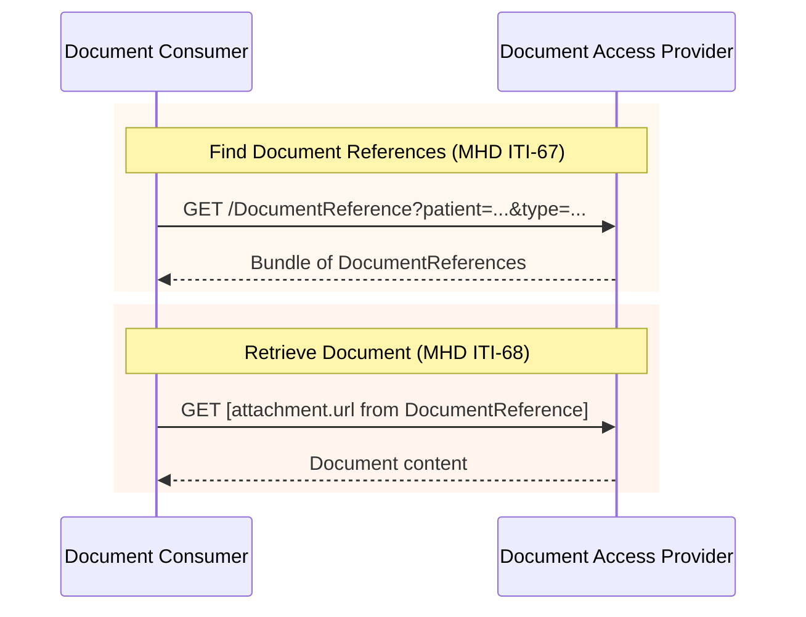

### Overview

Document exchange using IHE MHD (Mobile Health Documents) transactions. This IG inherits MHD transactions as-is, with constraints specific to EEHRxF content.

### Actors

- **Document Producer** (client): Publishes documents using MHD Document Source
- **Document Access Provider** (server): Receives and serves documents using MHD Document Recipient + Document Responder
- **Document Consumer** (client): Queries and retrieves documents using MHD Document Consumer

See [Actors and Transactions](actors.html) for detailed actor groupings.

### IHE MHD Transactions

This IG uses the following IHE MHD transactions:

| Transaction | Direction | Description | Scope |
|-------------|-----------|-------------|-------|
| [ITI-67](https://profiles.ihe.net/ITI/MHD/ITI-67.html) | Document Consumer → Document Access Provider | Find Document References | `system/DocumentReference.rs` |
| [ITI-68](https://profiles.ihe.net/ITI/MHD/ITI-68.html) | Document Consumer → Document Access Provider | Retrieve Document | See note below |
| [ITI-65](https://profiles.ihe.net/ITI/MHD/ITI-65.html) | Document Producer → Document Access Provider | Provide Document Bundle | `system/DocumentReference.c`, `system/Binary.c` or `system/Bundle.c` |

> **ITI-68 Scope Note:** The required scope depends on the document format. For non-FHIR documents (PDF), use `system/Binary.r`. For FHIR Documents (IPS, laboratory reports as FHIR Bundles), use `system/Bundle.r`. See [FHIR Documents vs Binary](#fhir-documents-vs-binary) below.

### Sequence Diagram



#### FHIR Documents vs Binary

ITI-68 retrieves the document from the URL specified in `DocumentReference.content.attachment.url`. The URL format depends on the document type:

| Document Format | attachment.url | Content-Type |
|-----------------|----------------|--------------|
| PDF and other non-FHIR | `/Binary/[id]` | `application/pdf`, etc. |
| FHIR Document (IPS, etc.) | `/Bundle/[id]` | `application/fhir+json` or `application/fhir+xml` |

This follows [MHD Section 2:3.65.4.1.2.1](https://profiles.ihe.net/ITI/MHD/ITI-65.html#236541-message-semantics), which specifies the **FHIR Document Publish Option**: when the `DocumentReference.content.attachment.url` points at a FHIR Document Bundle, that Bundle is retrieved directly without Binary encoding.

> **Implementation Note:** FHIR Documents do not require base64 encoding into a Binary resource. The document Bundle is stored and retrieved as a native FHIR Bundle resource.

### Document Search Strategy

This IG follows the [IHE Document Sharing](https://profiles.ihe.net/ITI/HIE-Whitepaper/index.html) approach:

1. **category** (coarse search): Broad classification based on EHDS priority categories
2. **type** (clinical precision): Specific document types, typically LOINC codes
3. **practiceSetting**: Clinical specialty (e.g., lab vs radiology)

#### Category Values (EHDS Priority Categories)

The EHDS priority categories are defined by [Article 14 of the EHDS Regulation](https://eur-lex.europa.eu/eli/reg/2025/327/oj#d1e2289-1-1). We define codes specifically for EEHRxF that map directly to these regulatory categories.

See [EEHRxFDocumentPriorityCategoryCS](CodeSystem-eehrxf-document-priority-category-cs.html) for the complete list.

#### Type Values (LOINC)

| LOINC Code | Priority Category |
|------------|-------------------|
| `60591-5` | Patient Summary |
| `18842-5` | Hospital Discharge Report |
| `11502-2` | Lab Result |
| `68604-8` | Diagnostic Imaging Report |

See [EEHRxFDocumentTypeVS](ValueSet-eehrxf-document-type-vs.html) for the complete list.

### Examples

The examples below show queries using both `category` (EHDS priority category) and `type` (LOINC document type). Either can be used depending on your use case.

#### Patient Summary

By type (LOINC):
```
GET [base]/DocumentReference?patient=Patient/123&type=http://loinc.org|60591-5&status=current
```

By category (EHDS priority):
```
GET [base]/DocumentReference?patient=Patient/123&category=http://hl7.eu/fhir/euridice-api/CodeSystem/eehrxf-document-priority-category-cs|Patient-Summaries&status=current
```

#### Medical Test Results (Laboratory)

By type (LOINC):
```
GET [base]/DocumentReference?patient=Patient/123&type=http://loinc.org|11502-2&status=current
```

By category (EHDS priority):
```
GET [base]/DocumentReference?patient=Patient/123&category=http://hl7.eu/fhir/euridice-api/CodeSystem/eehrxf-document-priority-category-cs|Laboratory-Reports&status=current
```

#### Imaging Reports and Manifests

By type (LOINC - imaging reports only):
```
GET [base]/DocumentReference?patient=Patient/123&type=http://loinc.org|68604-8&status=current
```

By category (EHDS priority - includes both reports and manifests):
```
GET [base]/DocumentReference?patient=Patient/123&category=http://hl7.eu/fhir/euridice-api/CodeSystem/eehrxf-document-priority-category-cs|Medical-Imaging&status=current
```

> **Note:** The `Medical-Imaging` category includes both imaging reports and imaging manifests. To distinguish between them, use the `type` code or `formatCode`. See [Imaging Manifest](priority-area-imaging-manifest.html) for details.

#### Hospital Discharge Reports

By type (LOINC):
```
GET [base]/DocumentReference?patient=Patient/123&type=http://loinc.org|18842-5&status=current
```

By category (EHDS priority):
```
GET [base]/DocumentReference?patient=Patient/123&category=http://hl7.eu/fhir/euridice-api/CodeSystem/eehrxf-document-priority-category-cs|Discharge-Reports&status=current
```

### Document Publication (ITI-65)

Document Producers publish documents by POSTing a transaction Bundle:

```
POST [base]
Content-Type: application/fhir+json
```

The Bundle contains DocumentReference + Binary resources. See [IHE MHD ITI-65](https://profiles.ihe.net/ITI/MHD/ITI-65.html) for details.

> **Open Issue #3**: We are seeking input on MHD publication transaction options. See [MHD Publication Transaction Options](open-issues.html#issue-3-mhd-publication-transaction-options) for discussion.

### References

- [IHE MHD Specification](https://profiles.ihe.net/ITI/MHD/)
- [IHE Document Sharing](https://profiles.ihe.net/ITI/HIE-Whitepaper/index.html)
- [Actors and Transactions](actors.html)
