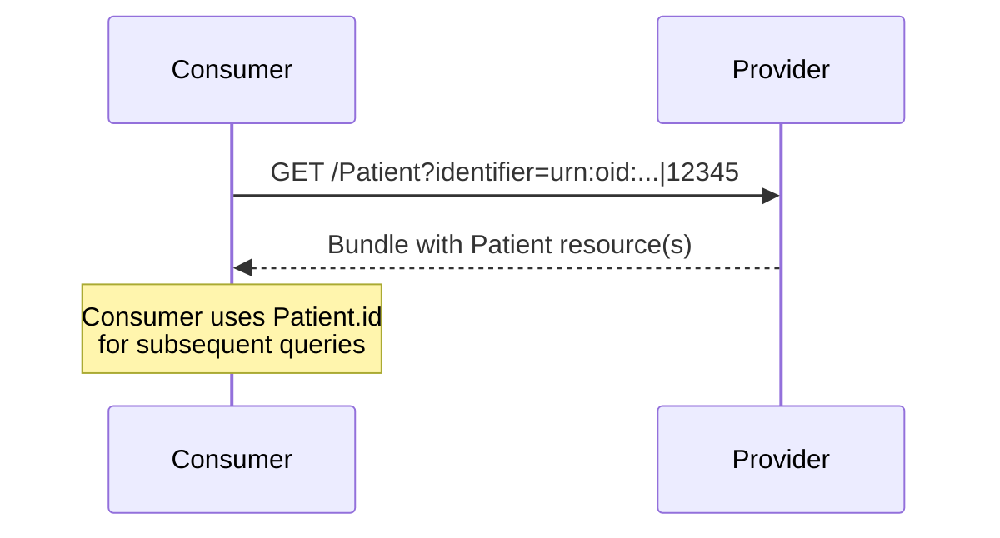

### Overview

Patient identification using IHE PDQm (Patient Demographics Query for Mobile). This transaction allows consumers to locate the correct Patient resource on a provider before querying for health information.

### Actor Roles

| Actor | Role |
|-------|------|
| Consumer | Find a patient based on either identifier or demographics information |
| Provider | Return information on supported patients and allow for searching of specific patients |

### Transaction Options

Providers support one or more of the following patient identification mechanisms:

#### 1. Basic Patient Demographics Query (Required)

Identifier-based patient lookup using FHIR search. This option is suitable for well-established infrastructures where identifier-based matching is sufficient.

```
GET [base]/Patient?identifier=[system]|[value]
```

Providers implementing this transaction SHALL indicate the main identifiers used via the `supported-identifier` extension in their CapabilityStatement.

**Search Parameters:**

| Parameter | Type | Description |
|-----------|------|-------------|
| identifier | token | Identifier associated with the patient (e.g., national ID, MRN) |

It is RECOMMENDED that identifier-based searches use one of the identifier systems declared in the provider's CapabilityStatement.

#### 2. Mobile Patient Demographics Query [ITI-78] (Optional)

Full IHE PDQm demographics search supporting multiple search parameters:

```
GET [base]/Patient?family=Smith&given=John&birthdate=1970-01-01
```

See [IHE PDQm ITI-78](https://profiles.ihe.net/ITI/PDQm/ITI-78.html) for full parameter list.

#### 3. Patient Demographics Match [ITI-119] (Optional)

Patient $match operation for fuzzy demographic matching:

```
POST [base]/Patient/$match
```

Body contains a Parameters resource with demographic information. The server responds with candidate matches and match scores.

See [IHE PDQm ITI-119](https://profiles.ihe.net/ITI/PDQm/ITI-119.html) for details.

### Provider Requirements

| Actor | Transaction | Optionality |
|-------|-------------|-------------|
| Consumer | Basic Patient Demographics Query | O |
|  | Mobile Patient Demographics Query [ITI-78] | O |
|  | Mobile Patient Match [ITI-119] | O |
| Provider | Basic Patient Demographics Query | R |
|  | Mobile Patient Demographics Query [ITI-78] | O |
|  | Mobile Patient Match [ITI-119] | O |

Providers are RECOMMENDED to implement either the Demographics Query or Match operation in addition to the Basic Demographics Query.

### Authorization

When grouped with IUA actors:
- Consumer uses Get Access Token [ITI-71] with appropriate scope
- Provider enforces authorization via Incorporate Access Token [ITI-72]

### Example Flow



### References

- [IHE PDQm](https://profiles.ihe.net/ITI/PDQm/index.html)
- [ITI-78 Mobile Patient Demographics Query](https://profiles.ihe.net/ITI/PDQm/ITI-78.html)
- [ITI-119 Patient Demographics Match](https://profiles.ihe.net/ITI/PDQm/ITI-119.html)
- [FHIR Patient.$match](https://hl7.org/fhir/R4/patient-operation-match.html)
