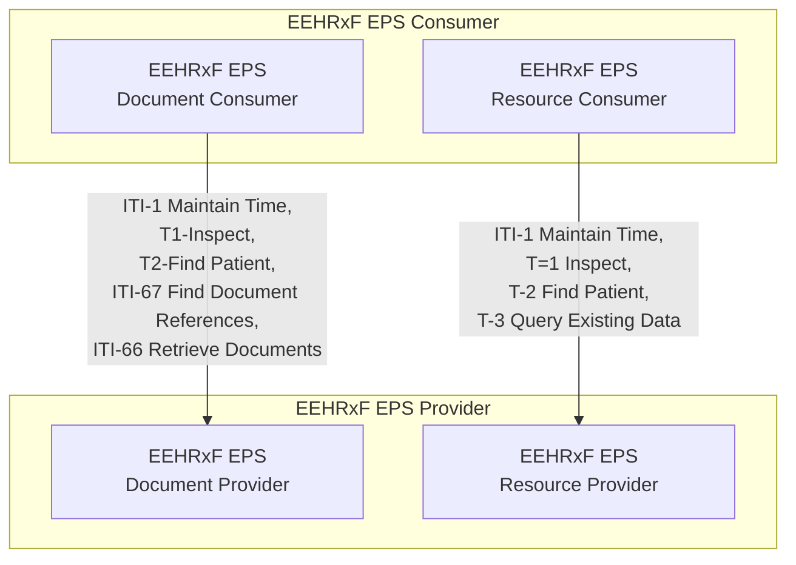


This section defines the API requirements for EHR systems that provide EEHRxF data that follows the {{hl7EuEps}}.

The transactions required by the EEHRxF EPS API are indicated in the figure below.

As {{hl7EuEps}} is document based, the normal set of transactions as defined in the base API specification apply. This part of the specification introduces the EPS variants of the base actors.

### Actor definitions

The following actors are defined:

| Actor | Description | Optionality | Link |
|=======|=============|=============|======|
| EPS Resource Consumer | Consumes/accesses resource based EPS data | R | EEHRxF Consumer |
||| R | [EPS Resource Consumer CapabilityStatement](CapabilityStatement-EEHRxF-EPS-Consumer-CapabilityStatement.html) |
|||||
| EPS Resource Provider | Provides resource based EPS data | R | EEHRxF Provider |
||| R | [EPS Resource Provider CapabilityStatement](CapabilityStatement-EEHRxF-EPS-Provider-CapabilityStatement.html) |

|||||
| EPS Document Consumer | Consumes/accesses document based EPS data | R | EEHRxF Consumer |
||| R | [IHE-MHD Document Consumer](https://profiles.ihe.net/ITI/MHD/CapabilityStatement-IHE.MHD.DocumentConsumer.html) |
|||||
| EPS Document Provider | Provides document based EPS data | R | EEHRxF Provider |
||| R | [IHE-MHD Document Responder](https://profiles.ihe.net/ITI/MHD/CapabilityStatement-IHE.MHD.DocumentResponder.html) |

Note: EPS Document Consumer and Providers SHALL use the [EPS MHD DocumentReference](StructureDefinition-EpsMhdDocumentReference.html) profile to represent EPS documents.

**TODO:** How to best reflect this is in CapabilityStatement. All the combinations of options make this difficult to express without generating a massive amount of CapabilityStatements. Would a CapabilityStatement profile be an option?