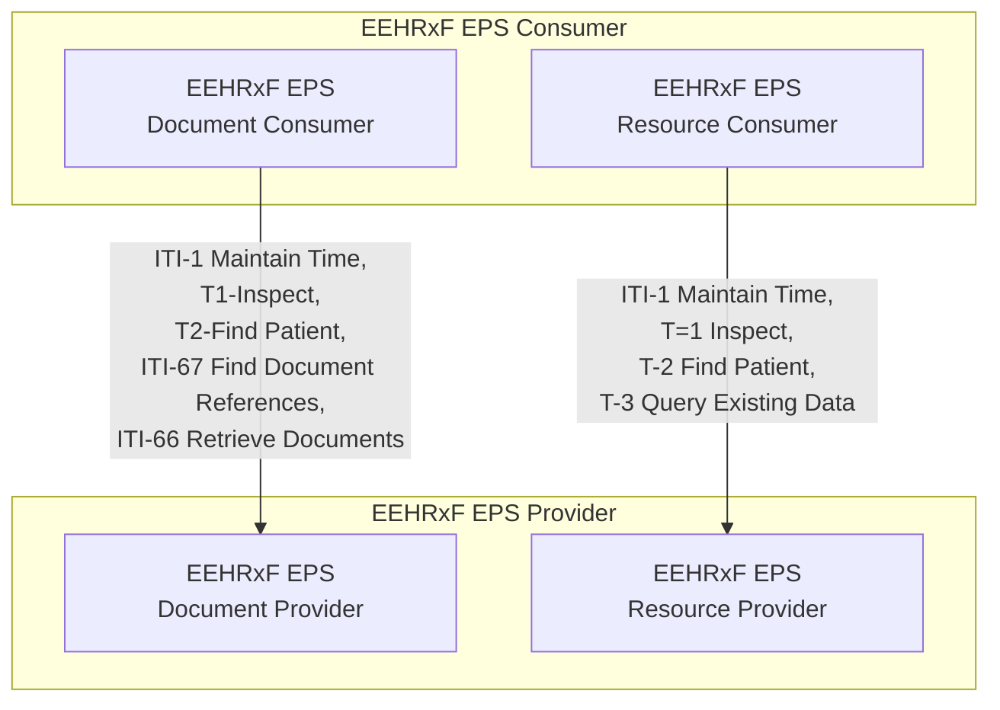


This section defines the API requirements for EHR systems that provide EEHRxF data that follows the {{hl7EuEps}}.

The transactions required by the EEHRxF EPS API are indicated in the figure below. 

As {{hl7EuEps}} is document based, the normal set of transactions as defined in the base API specification apply. This part of the specification introduces the EPS variants of the base actors.

Options:
Basic Resource (ITI-1, T2( Basic | match | search), T3 - Resources )
Basic Document (ITI-1, T2( Basic | match | search), ITI-66, ITI-67 )

QEDm options

| Actor | Option Name | Reference |
|=======|=============|===========|
| EEHRxF EPS Resource Consumer | |
|| Simple Observations | [IHE QEDm Section 1:18.2.1.1](https://profiles.ihe.net/PCC/QEDm/3.0.0-comment1/PCC-44.html#234441211-simple-observations-option-search-parameters) |
|| Allergies and Tolerances | [IHE QEDm Section 1:18.2.1.2](https://profiles.ihe.net/PCC/QEDm/3.0.0-comment1/PCC-44.html#234441212-allergies-and-intolerances-option-search-parameters) |
|| Conditions | [IHE QEDmSection 1:18.2.1.3](https://profiles.ihe.net/PCC/QEDm/3.0.0-comment1/PCC-44.html#234441213-conditions-option-search-parameters) |
|| Diagnostic Results | [IHE QEDmSection 1:18.2.1.4](https://profiles.ihe.net/PCC/QEDm/3.0.0-comment1/PCC-44.html#234441214-diagnostic-reports-option-search-parameters) |
|| Medications | [IHE QEDmSection 1:18.2.1.5](https://profiles.ihe.net/PCC/QEDm/3.0.0-comment1/PCC-44.html#234441215-medications-option-search-parameters) |
|| Immunizations | [IHE QEDmSection 1:18.2.1.6](https://profiles.ihe.net/PCC/QEDm/3.0.0-comment1/PCC-44.html#234441216-immunizations-option-search-parameters) |
|| Procedures | [IHE QEDmSection 1:18.2.1.7](https://profiles.ihe.net/PCC/QEDm/3.0.0-comment1/PCC-44.html#234441217-procedures-option-search-parameters) |
|| Encounters | [IHE QEDmSection 1:18.2.1.8](https://profiles.ihe.net/PCC/QEDm/3.0.0-comment1/PCC-44.html#234441218-encounters-option-search-parameters) |
|| Provenance | [IHE QEDmSection 1:18.2.1.9](https://profiles.ihe.net/PCC/QEDm/3.0.0-comment1/PCC-44.html#234441219-provenance-option-search-parameters) |

EPS resources:
* Composition (EPS)
* Practitioner (EUcore)
* PractitionerRole (EUcore)
* Device
* Organization (EU)
* Patient
* RelatedPerson
* AllergyIntolerance (EPS)
* DocumentReference
* MedicationStatement (EPS)
* MedicationRequest (EPS)
* Immunization (EPS)
* Observation 
* DiagnosticReport
* Procedure
* DeviceUseStatement
* Consent (Advanced Directives EPS)
* Flag
* Condition
* ClinicalImpression
* DocumentReference
* CarePlan
* ImmunizationRecommendation

</tr>
<tr class="odd">
<td rowspan="10">Clinical Data Consumer](  ) |
<td>Simple Observations | [IHE QEDmSection 1:18.2.2.1](  ) |
|| Allergies and Intolerances | [IHE QEDmSection 1:18.2.2.2](  ) |
||Conditions | [IHE QEDmSection 1:18.2.2.3](  ) |
|| Diagnostic Results | [IHE QEDmSection 1:18.2.2.4](  ) |
||Medications | [IHE QEDmSection 1:18.2.2.5](  ) |
|| Immunizations | [IHE QEDmSection 1:18.2.2.6](  ) |
||Procedures | [IHE QEDmSection 1:18.2.2.7](  ) |
|| Encounters | [IHE QEDmSection 1:18.2.2.8](  ) |
||Provenance | [IHE QEDmSection 1:18.2.2.9](  ) |
|| Occupational Data for Health | [IHE QEDmSection 1:18.2.2.10](  ) |
</tr>
</tbody>
</table>

EPS resources:
* Composition (EPS)
* Practitioner (EUcore)
* PractitionerRole (EUcore)
* Device
* Organization (EU)
* Patient
* RelatedPerson
* Condition (EPS)
* AllergyIntolerance (EPS)
* DocumentReference
* MedicationStatement (EPS)
* MedicationRequest (EPS)
* Immunization (EPS)
* Observation 
* DiagnosticReport
* Procedure
* DeviceUseStatement
* Consent (Advanced Directives EPS)
* Flag
* Condition
* ClinicalImpression
* DocumentReference
* CarePlan
* ImmunizationRecommendation
* 