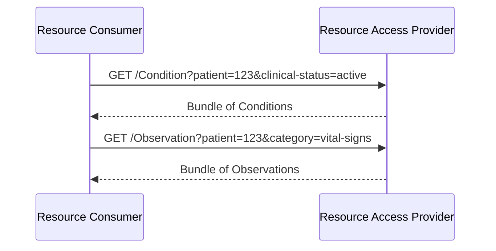

### Overview

FHIR resource query for direct access to clinical data. This capability is **optional** - not all implementations support resource access.

### Actors

- **Resource Access Provider** (server): Provides resource query capabilities
- **Resource Consumer** (client): Queries resources

See [Actors and Transactions](actors.html) for detailed actor groupings.

<details>
<summary><i>Note: What about Resource Producer? Click for more</i></summary>

Resource exchange is more complex than document publication, and in many cases has resource and use-case specific considerations. Within the scope of this version of the IG, we assume a precondition that the Resource Access Provider has access to resources and focus on defining how the Resource Access Provider enables a consumer to search and read those resources. For more details and possible approaches, see the <a href="resourceExchange.html">Resource Exchange</a> page.

</details>

### Specifications

This IG aligns with:

- [HL7 International Patient Access (IPA)](https://build.fhir.org/ig/HL7/fhir-ipa/) - Resource access patterns and CapabilityStatements
- [IHE QEDm](https://profiles.ihe.net/PCC/QEDm/) - Query Existing Data mobile, where compatible with IPA. QEDm has a goal of aligning with IPA.
  - [PCC-44](https://profiles.ihe.net/PCC/QEDm/PCC-44.html) - Mobile Query Existing Data transaction

### Sequence Diagram



### Constraints

- **Read/search only** - No create/update/delete operations. 
- **Patient-scoped queries** - `patient` parameter required on all searches
- Searches without `patient` parameter are rejected


### Core Resources

The following resources are available for read/search access. Data models inherit from [HL7 Europe Core](https://build.fhir.org/ig/hl7-eu/base/). Required search parameters are from [IPA](https://build.fhir.org/ig/HL7/fhir-ipa/).

| Resource | Required Search Parameters |
|----------|---------------------------|
| AllergyIntolerance | `patient` |
| Condition | `patient` |
| Observation | `patient`, `category` |
| DiagnosticReport | `patient`, `category` |
| MedicationRequest | `patient` |
| MedicationDispense | `patient` |
| MedicationStatement | `patient` |
| Immunization | `patient` |
| Encounter | `patient` |

> **Open Issue #9**: We are seeking validation of this core resource set. See [Core Resource Set Validation](open-issues.html#issue-9-core-resource-set-validation) for discussion.

### Scopes

```
system/AllergyIntolerance.rs
system/Condition.rs
system/Observation.rs
system/DiagnosticReport.rs
system/MedicationRequest.rs
system/Immunization.rs
system/Encounter.rs
```

### Example Queries

```
GET /AllergyIntolerance?patient=123
GET /Condition?patient=123&clinical-status=active
GET /Observation?patient=123&category=vital-signs&date=ge2024-01-01
GET /DiagnosticReport?patient=123&category=LAB
GET /MedicationRequest?patient=123&status=active
```

### Derived Resources

If resources are derived from documents, Provenance SHOULD link to source DocumentReference:

```json
{
  "resourceType": "Provenance",
  "target": [{"reference": "Observation/123"}],
  "entity": [{
    "role": "source",
    "what": {"reference": "DocumentReference/abc"}
  }]
}
```

The [IHE mXDE](https://profiles.ihe.net/ITI/mXDE/index.html) profile provides more detail on how to extra resources from documents while maintaining provenance.  


### References

- [HL7 International Patient Access (IPA)](https://build.fhir.org/ig/HL7/fhir-ipa/)
- [IHE QEDm](https://profiles.ihe.net/PCC/QEDm/)
  - [PCC-44 Mobile Query Existing Data](https://profiles.ihe.net/PCC/QEDm/PCC-44.html)
- [Actors and Transactions](actors.html)

### IPA vs QEDm

This IG uses [IPA](https://build.fhir.org/ig/HL7/fhir-ipa/) as the primary reference for CapabilityStatements and search parameters. QEDm is referenced where compatible with IPA - and QEDm has a stated goal of aligning with IPA.

> **Open Issue #4**: We are seeking input on IPA vs QEDm inheritance. See [Resource Access and Inheritance](open-issues.html#issue-4-resource-access-and-inheritance) for discussion.
