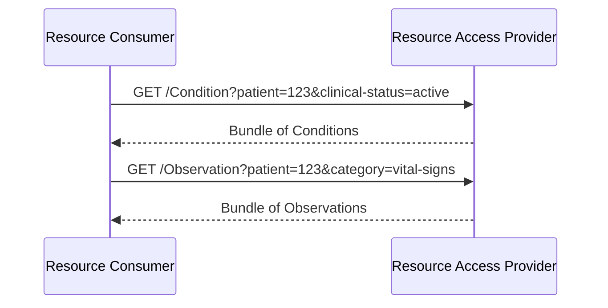

### Overview

FHIR resource query for direct access to clinical data. This capability is **optional** - not all implementations support resource access.

### Actors

- **Resource Access Provider** (server): Provides resource query capabilities
- **Resource Consumer** (client): Queries resources

See [Actors and Transactions](actors.html) for detailed actor groupings.

### Specifications

This IG aligns with:

- [HL7 International Patient Access (IPA)](https://build.fhir.org/ig/HL7/fhir-ipa/) - Resource access patterns and CapabilityStatements
- [IHE QEDm](https://profiles.ihe.net/PCC/QEDm/) - Query Existing Data mobile
- [PCC-44](https://profiles.ihe.net/PCC/QEDm/PCC-44.html) - Mobile Query Existing Data transaction

### Sequence Diagram



### Constraints

- **Read/search only** - No create/update/delete operations
- **Patient-scoped queries** - `patient` parameter required on all searches
- Searches without `patient` parameter are rejected

### Core Resources

The following resources are available for read/search access. Data models inherit from [HL7 Europe Core](https://build.fhir.org/ig/hl7-eu/base/).

| Resource | Search Parameters |
|----------|-------------------|
| AllergyIntolerance | `patient` |
| Condition | `patient`, `clinical-status` |
| Observation | `patient`, `category`, `date` |
| DiagnosticReport | `patient`, `category` |
| MedicationRequest | `patient`, `status` |
| MedicationStatement | `patient`, `status` |
| Immunization | `patient`, `date` |
| Encounter | `patient`, `date` |

### Scopes

```
system/AllergyIntolerance.rs
system/Condition.rs
system/Observation.rs
system/DiagnosticReport.rs
system/MedicationRequest.rs
system/Immunization.rs
system/Encounter.rs
```

### Example Queries

```
GET /AllergyIntolerance?patient=123
GET /Condition?patient=123&clinical-status=active
GET /Observation?patient=123&category=vital-signs&date=ge2024-01-01
GET /DiagnosticReport?patient=123&category=LAB
GET /MedicationRequest?patient=123&status=active
```

### Derived Resources

If resources are derived from documents, Provenance SHOULD link to source DocumentReference:

```json
{
  "resourceType": "Provenance",
  "target": [{"reference": "Observation/123"}],
  "entity": [{
    "role": "source",
    "what": {"reference": "DocumentReference/abc"}
  }]
}
```

### References

- [HL7 International Patient Access](https://build.fhir.org/ig/HL7/fhir-ipa/)
- [IHE QEDm](https://profiles.ihe.net/PCC/QEDm/)
- [PCC-44 Mobile Query Existing Data](https://profiles.ihe.net/PCC/QEDm/PCC-44.html)
- [Actors and Transactions](actors.html)

### IPA vs QEDm

Both IPA and QEDm define similar resource access patterns. This IG uses IPA as the primary reference for CapabilityStatements and aligns with QEDm transaction semantics. The approaches are compatible and complementary.
