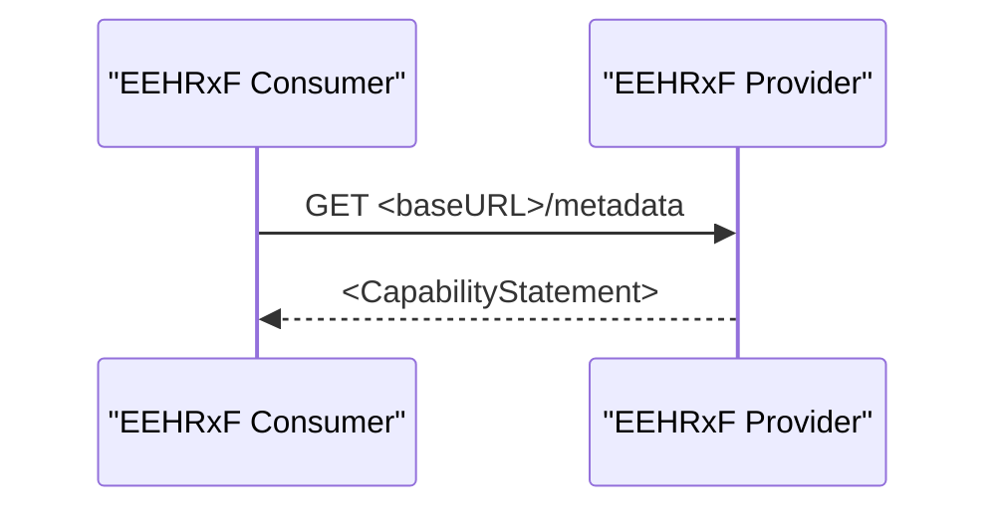

This section defines transaction T1. Transaction T1 is used between a EEHRxF Consumer and Provider. It is used by the EEHRxF Consumer to inspect the capabilities of the EEHRxF Provider related to the type of content exchange that is supported (Document and/or Resource) and which Priority Areas the EEHRxF Provider supports.

### Scope

This transaction allows a EEHRxF Consumer to inspect the capabilities of an EEHRxF Provider.

### Actor Roles

| Actor | Role |
| EEHRxF Consumer | Inspect the capabilities |
| EEHRxF Provider | Provide information on its capabilities |

### Referenced Standards

FHIR-R4 [HL7 FHIR Release 4.0](http://www.hl7.org/FHIR/R4)

### Messages

The exchange is a regular FHIR request metadata call which returns a CapabilityStatement that conforms to [EEHRxF-Provider](CapabilityStatement-EERxF-Provider.html).

