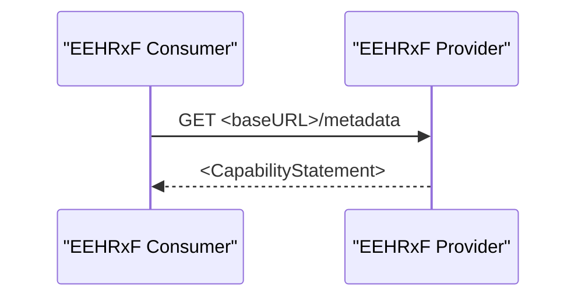

This transaction is used by the EEHRxF Consumer to locate the Patient resource in the EEHRxF Provider that corresponds to the patient whose information is to be retrieved.

### Scope

TBD

### Actor Roles

| Actor | Role |
| EEHRxF Consumer | Inspect the capabilities |
| EEHRxF Provider | Provide information on its capabilities |

### Referenced Standards

FHIR-R4 [HL7 FHIR Release 4.0](http://www.hl7.org/FHIR/R4)

### Messages

TBD
