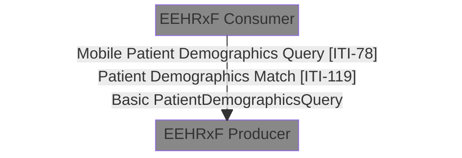
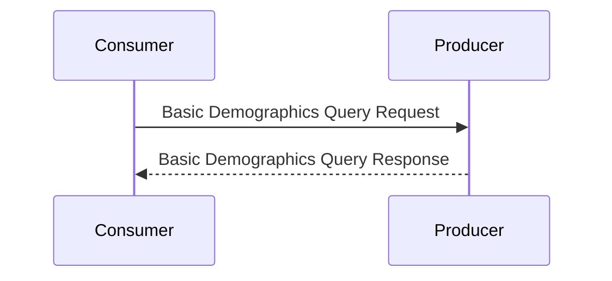



This transaction is used by the EEHRxF Consumer to locate the Patient resource in the EEHRxF Provider that corresponds to the patient whose information is to be retrieved.

### Scope

This transaction leverages the work done by IHE-PDQm with the following changes and adds a third option.



This option has been added as in some situations EHR system work in well established infrastructures where identifier based matching is sufficient.

### Referenced Standards

* {{FHIR}}
* {{ihePDQm}}

### Actor Roles

{:.grid}
| Actor | Role |
|=======|======|
| EEHRxF Consumer | Find a patient based on either identifier or demographics information. |
| EEHRxF Producer | Return information on supported patients and allow for searching of specific patients. |

### Actor Options

{:.grid}
| Actor | Transaction | Optionality |
|=======|=============|=============|
| EEHRxF Consumer | Basic Patient Demographics Query | O |
|                 | Mobile Patient Demographics Query [ITI-78](https://profiles.ihe.net/ITI/PDQm/ITI-78.html) | O |
|                 | Mobile Patient Match [ITI-119](https://profiles.ihe.net/ITI/PDQm/ITI-119.html) | O |
|||
| EEHRxF Provider | Basic Patient Demographics Query | R |
|                 | Mobile Patient Demographics Query [ITI-78](https://profiles.ihe.net/ITI/PDQm/ITI-78.html) | O |
|                 | Mobile Patient Match [ITI-119](https://profiles.ihe.net/ITI/PDQm/ITI-119.html) | O |

EEHRxF Provider are RECOMMENDED to implement either the Demographics or Match operation in addition to the Basic Demographics Query.

### Basic Demographics Query

EEHRxF Producers implementing this transaction SHALL indicate the main identifiers used as the preferred way to identity certain patients (e.g. MRN for Patient), it SHALL indicate so by including one or more [`supported-identifer`](Extension-SupportedIdentifier.html) extensions to the {{CapabilityStatement}}

When the EEHRxF producer has one or more identifier types that are used as the preferred way to identity non-patient resources, it SHOULD indicate so by including one or more [`supported-identifer`](Extension-SupportedIdentifier.html) extensions to the {{CapabilityStatement}}.

### Messages



#### Basic Demographics Query Message

This message represents a parameterized search from the EEHRxF Consumer to the EEHRxF Provider.

The request message is a standard FHIR Search request. The EEHRxF Consumer MAY use GET or POST based searches, and the EEHRxF Provider SHALL support both GET and SHOULD support POST based searches. This operation can be invoked at the following path:

```
    [base]/Patient?<parameters>
```


2:3.78.4.1.2.1 Search Parameters
The EEHRxF Consumer MAY supply, and the EEHRxF Provider SHALL be capable of processing all parameters listed below. 

{:.grid}
| Parameter	| definitions |
|===========|=============|
| identifier | This repeating parameter of type token, when supplied, specifies an identifier associated with the patient whose information is being queried (e.g., a local identifier, account identifier, etc.). It is RECOMMENDED that identifier based searches are preformed using one of the identifier systems provided in the [`supported-identifer`](Extension-SupportedIdentifier.html) extension. |

#### Security Considerations

See the general Security Consideration in ITI TF-1: 38.5.

##### Security Audit Considerations

The Mobile Patient Demographics Query Transaction is a Query Information event as defined in Table 3.20.4.1.1.1-1. The actors involved SHALL record audit events according to the following:

##### Patient Demographics Consumer Audit
The Patient Demographics Consumer when grouped with ATNA Secure Node or Secure Application Actor SHALL be able to record a Patient Demographics Consumer AuditEvent. 

##### Patient Demographics Supplier Audit

The Patient Demographics Supplier when grouped with ATNA Secure Node or Secure Application Actor SHALL be able to record a Patient Demographics Supplier AuditEvent. Audit Example for a PDQm Query transaction from supplier perspective.

##### Use with the Internet User Authorization (IUA) Profile

The Internet User Authorization (IUA) Profile provides support for user authentication, app authentication, and authorization decisions. When PDQm actors are grouped with IUA actors there are additional security and privacy functionality enabled by this grouping. There are additional requirements and functionality enabled through scope definitions that are transaction-specific.

A Patient Demographics Consumer, when grouped with an IUA Authorization Client, SHALL use Get Access Token [ITI-71] to request the following scope from the IUA Authorization Server. This enables the Patient Demographics Consumer to get corresponding identifiers with the Mobile Patient Demographics Query [ITI-78] transaction with the authorizing token in the combined transaction Incorporate Access Token [ITI-72].

The Patient Demographics Supplier, when grouped with an IUA Resource Server, SHALL require Incorporate Access Token [ITI-72] in all Mobile Patient Demographics Query [ITI-78] transactions, SHALL enforce the authorization decision in the token, and MAY further enforce policies beyond those made by the Authorization Server such as consent or business rules.

```text
scope: EHRsys-T2
```

This scope request authorizes the full [ITI-78] transaction. This scope implicitly requests patient-specific queries for getting corresponding demographics. Further scope refinement is allowed in realm or project-specific situations; these scopes would be in addition to the scope defined here.
